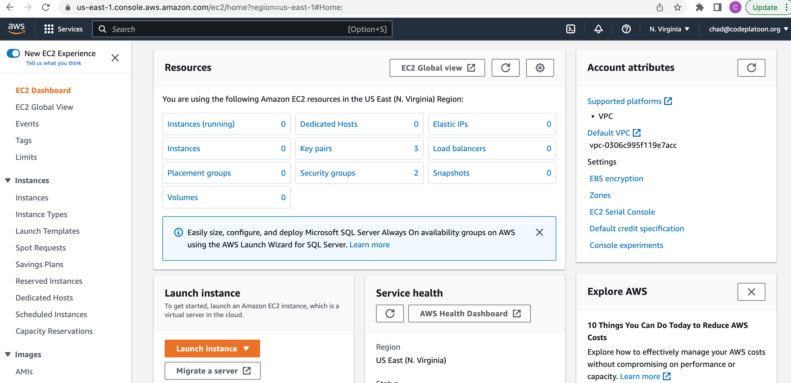
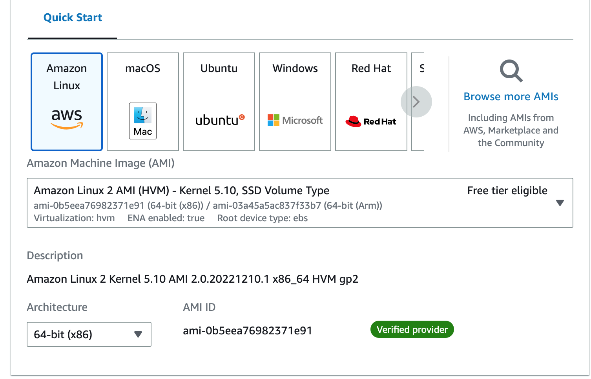
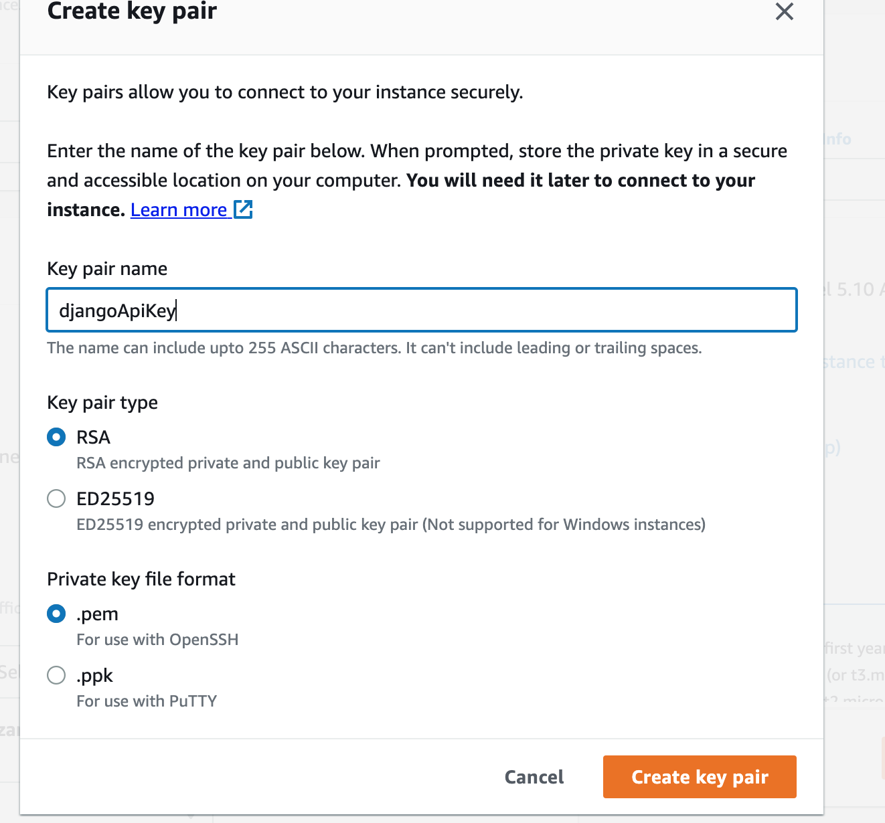
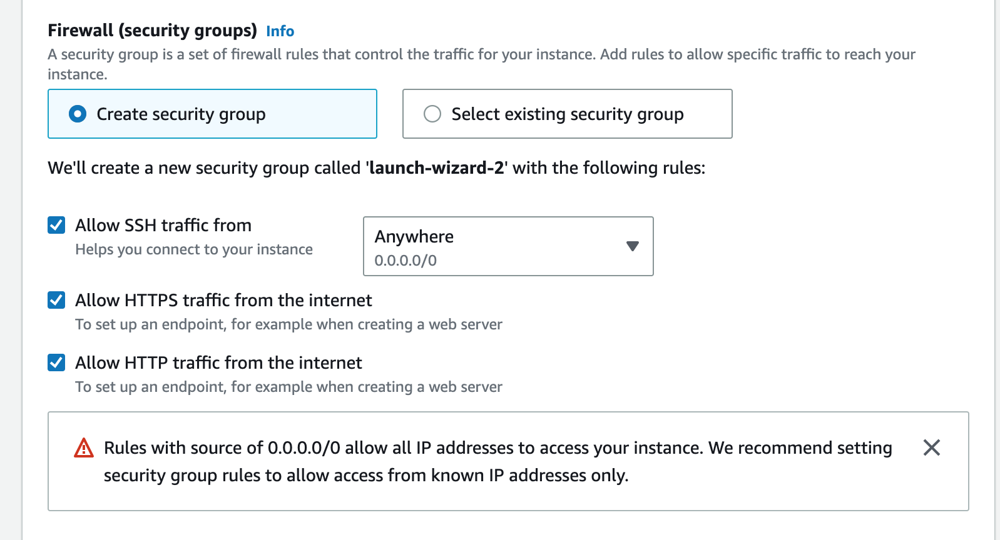
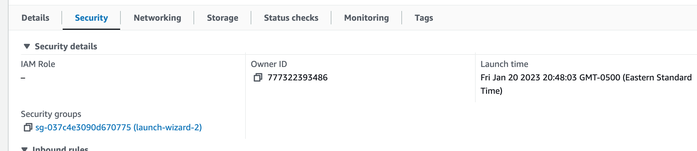
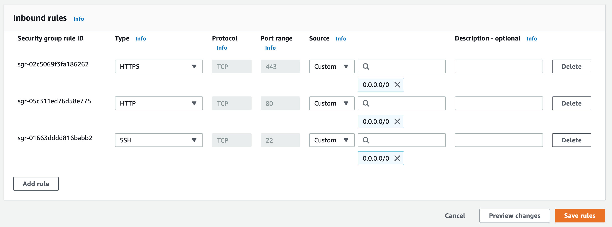
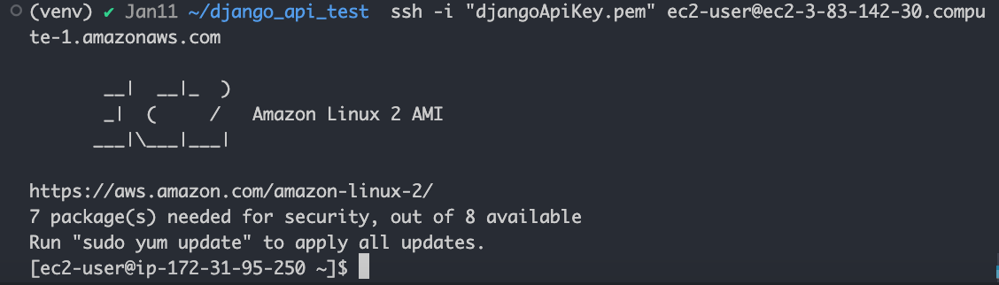

## Deploying a Dockerized Django API to AWS EC2

Log in to your AWS account and search under `Services` for `EC2`.



Click `Launch instance`.  You can then give your instance a name.

Choose the `Amazon Linux` AMI.  This will be the host's operating system.  



Choose the `t2.micro` Instance type (it is free and good enough).

Next you will need to create a key pair.  We're not going to worry about the details, but this is to ensure that only you will have the ability to execute commands on your EC2 instance.



Save the file (in this example, djangoApiKey.pen) somewhere.  You will need it to access your EC2 instance.

For now, you can allow incoming traffic from anywhere (though you could specify the IP address for SSH traffic if you work from the same place every day).



You can use the default settings for everything else.

Create your instance and wait for it to be in the `Running` state.

There is one more thing you'll have to do to allow incoming traffic.
Click on the instance to get the detail view.  Then click on the `Security` tab.



Click the security group, then `Edit inbound rules`.  If you need to, add rules to allow for incoming traffic:



Now that your permissions are set up, go back to the instance detail view.  Click on `Connect`

From here you are going to ssh into your instance to install and set up the server.  If you are at the same level as your private key (djangoApiKey.pem), you can run the AWS suggested command: ` ssh -i "djangoApiKey.pem" ec2-user@ec2-3-83-142-30.compute-1.amazonaws.com`

Type `yes` to get past the warning.  You are now in the remote host's shell:



Since our application container is going to take care of its dependencies, we really only need to install Docker:

- Install Docker
```bash
sudo amazon-linux-extras install docker
sudo service docker start
sudo usermod -a -G docker ec2-user
```

After that, you just need to pull your application image and run it.