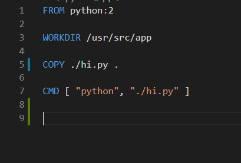

# Introduction to Docker


Has this ever happened to you...?

You write a Python program on your local machine, and of course you are using the latest and greatest version of Python (say 3.8).  You finish it up and then push it up to Github for all the world, and yourself, to use.  A few weeks later you are on another machine and decide your program would come in handy.  So you pull down your repo and run your program.

All of a sudden, you get strange errors.  Modules are missing, some library doesn't work, or there are syntax errors.  But you are sure you tested it well on your local machine before you pushed it up to Github.  What is happening?

After some investigation, you realize that the computer you are trying to run your program on only has Python 2.7.  At this point you have a couple options:
1. Go through your program and change anything that isn't compatable with Python 2.7.  Hopefully, nothing in your program requires a feature that isn't compatable with Python 2.7...
2. Update the version of Python on the computer you are currently using.  Hopefully, you have permission to install a new program...

At this point you are probably annoyed and frustrated.  Just imagine if you had a much more complicated program that used several languages, libraries, operating systems, etc.  It can get very messy very quickly.

Fortunately there is something out there that can solve this problem for us: Docker.  


Docker basically takes your program and wraps it up in everything it needs to run.  So wherever you run it, it has everything that it needs. 

This technology is called "containerization".  The metaphor comes from the shipping industry, where everything is shipped in uniform containers.  That way, the people shipping it only have to worry about the outermost layer.  The tanker captain doesn't care if the shipping container is full of rice, teddy bears, or farm equipment-- they all stack the same way.

Docker puts your application in a self-sufficient "container" that will run the same anywhere.  As long as your machine has Docker, you don't need to worry about what version of Python is installed.  You tell Docker everything your application needs to run, and the rest is taken care of.

Most likely that sounds very abstract and complicated.  I would suggest not wasting too much time trying to wrap your head around the nuts and bolts.  We want to <i>use</i> it, and using it is surprisingly easy.

How does Docker know what our application needs to run?  Quite simply, use a Dockerfile to tell it.  Here is what a very basic Dockerfile looks like:



Not too bad, right?

The "FROM" command tells Docker which image to start out with.
The "WORKDIR" command tells Docker where in the container to run commands.
(NOTE: "image" is like a class and "container" is like an instance)
The "COPY" command tells Docker to copy whatever is in our current local directory into the Docker container (this would be our program)
The "CMD" command tells Docker what command to run in our container to get things started off

In other words, we are saying, "Hey Docker, I'd like to have a container that runs Python 2.7.  Once you get that ready, go ahead and prepare to run some commands from /usr/src/app.  Then I'd like you to copy all the files that are in my current directory into /usr/src/app in the container.  Finally, if you would be so kind, please have Python run the file that you just copied /usr/src/app/hi.py"

It is just that easy.  

But before we start actually creating containers, we'll need to create an account (I know...) with the [Docker people](https://hub.docker.com/). Once you create an account, you will be able to pull images and create your own--just like Github, but for images.

 All of the images (the "FROM" line) come from [hub.docker.com](hub.docker.com).  For some reason, we wanted to run a Python 2.7 program, right?  So let's search for images that will work:

 

 Oh look, it's an official image!  If we visit the official Python Docker image repo, we encounter an embarassment of images.  For now, we'll just do what the README suggests: FROM python:2

 OK, now we should be good to start building our image with our program in it.  We'll be doing this from the command line.

 ```bash
 docker login
 ```

cd into the directory that has your Dockerfile (it should be called simply "Dockerfile"-- no extensions) and your program.  

``` bash
docker build -t python-says-hi .
```

This will build an image from the Dockerfile in the current directory (note the "."), and give it a nice name.

When you build your image, you should see quite a bit going on.  That's just Docker following your instructions and pulling down what you asked for, and running the other commands, one at a time.  

After Docker finishes building your image, you can take a look at it:

```bash
docker images
```

We should see it there, along with any other images you might have, just hanging out waiting to be run. Let's go ahead and run it:

```bash
docker run python-says-hi
```

Did it work?  That sure does seem like a lot of overhead just to print two words.  Maybe this is all just smoke and mirrors.

Docker lets you run containers in a couple of different ways.  This time we'll run the container with the shell so we can poke around inside it:

```bash
docker run -it python-says-hi bash
```
The the "-it" options are commonly used when you want to interact with your container's files.  "bash" lets you run a shell so you actually have something to look at.

Let's see if our program made it into the container.  If you `ls`, you should see something like this:


Let's check what version of Python is running in our container:

```bash
python --version
```


Now let's check what operating system is running in our container:

```bash
cat /etc/os-release
```


OK, so we really are running in a different environment!

Now let's try running our file:


Everything works!  Docker created a nice isolated Python 2.7 file for us that we can run from anywhere, regardless of our local environment.

Another thing you might find useful is running containers in the background.  This allows you to do other things on your command line. In Docker this is called running in "detached" mode.

```bash
docker run -it -d python-says-hi bash
```

How do you know if it's really running?  Docker has a command for that too:

```bash
docker ps
```

"docker ps" lists out all of the currently running containers on your machine.  If you want to see all the containers on your machine, including ones that aren't currently running, you can add the "-a" flag.

```bash
docker ps -a
```

As exciting as our application is, we are probably going to want to stop it at some point. There are a couple ways to reference the container you would like to stop.  The first uses the "name" (a somewhat random default name, unless you specify one):

```bash
docker stop charming_mendeleev
```

The second uses the "container id":

```bash
docker stop 73994029015d 
```

And if you're feeling especially lazy, you can just give the first two or three characters (as long as it enough to be unique among your containers):

```bash
docker stop 73 
```

OK, so far you can create a docker image from scratch using a Dockerfile, and then run your container.  Pretty impressive.  

But you know, I've been thinking.  How do we know that our container is really running 2.7?  Maybe this is all a dream.

Let's try a test.  We'll copy a new file into our container that has a print statement that uses Python 3 syntax, and see what happens.

We first restart our container:

```bash
docker run -it -d python-says-hi bash
```

Then we copy our file into the directory we designated in the container:

```bash
docker cp ./hi_in_3.py eager_mendel:/usr/src/app
```

Then we will "exec" into our running container, so we can take a look around:

```bash
docker exec -it eager_mendel bash
```

This is just like what we did when we ran the container.  The difference is that we are now accessing the container while it's already running.

If we ls, we should see our new file.  Let's run it and see what happens:


Success!  Sort of.  It failed!  

I think even the most sceptical mind should now be satisfied that Docker really is running a different thing.


## Challenge
[Docker Introduction Challenge](https://github.com/deltaplatoonew/docker-intro)


