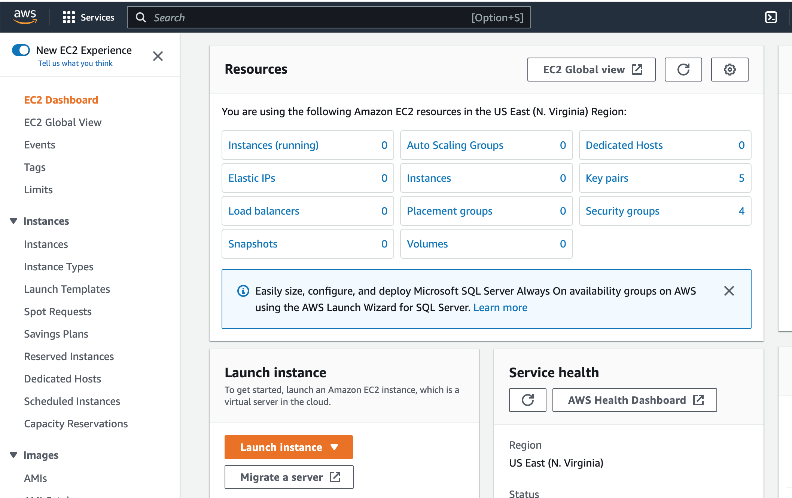
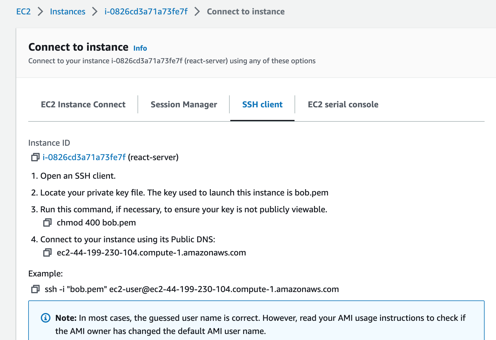

# Dockerize and Deploy a React App Using React Router


## Dockerize
We'll start with [this](https://github.com/deltaplatoonew/dockerize-react-router-demo) dummy React app.  So go ahead and do the usual `git clone` and `npm install`,

Running it locally using the development server is fine while you're developing, but when it comes time to actually deploy your app, you'll want a more robust server.

For that we'll use [nginx](https://www.nginx.com/).  To be more precise, we'll use the [official nginx image](https://hub.docker.com/_/nginx) on Dockerhub.

To make things simple, we're going to use all the default configurations, but you might want to customize things later.

In order for nginx to serve our React app, we need to create a production build.  As you have been learning React, you might have forgotten, but all your fancy React code is really just going to be html, javascript, and css.  Inside your `package.json` should be a script alias called `build`.  

Run `npm run build`. This will create a `/build` directory in the root of your project.  If you look at the files created, you probably won't recognize your handiwork, but that's OK.

Once you have the `/build` directory, we're going to need to create a Dockerfile to copy over those files where nginx expects them to be.

In the root of your project, create a Dockerfile, and add these lines:
```bash
FROM nginx:alpine

COPY ./build /usr/share/nginx/html
```

It seems too easy.  

All we have to do is start from a minimal (alpine) official nginx container (which has the operating system and all the dependencies that nginx needs--so you don't have to do all that gruntwork yourself).  We then copy over the `/build` directory into the directory that nginx expects by default; this just happens to be `/usr/share/nginx/html`.

Once the production build and the runtime environment are ready, we can test out our production infrastructure locally.  To create an image based on the Dockerfile specifications, run `docker build -t react-server .`

Now run `docker images`. You should see something like the below:

```bash
REPOSITORY               TAG       IMAGE ID       CREATED        SIZE
react-server             latest    b87f88c3d75f   1 second ago   41.6MB
```

Once you have your customized image, you need to actually run it.  Nginx will listen on port 80 by default (the standard HTTP port), so for now, we'll map the host port (your laptop) port 8090 to the container's port 80:  `docker run -p 8090:80 react-server`

You should be able to visit [http://localhost:8090/#/things](http://localhost:8090/#/things) and link to [http://localhost:8090/#/stuff](http://localhost:8090/#/stuff).  Note the hash tag.

When you're done grabassing around with your merely local deployment, you can stop the container with `control + c` and remove the instance you ran by running `docker ps -a`, getting the appropriate image id, then running `docker rm <IMAGE ID>`.

### Push up Your Image
Now that your image is ready, you should push it up to Dockerhub (like github, but for images) so you can access it from anywhere (such as your server).

If you are not already logged in to Dockerhub, run `docker login`.  You will then need to rename your image and push it up.

`docker tag react-server <DOCKERHUB_USERNAME>/react-server`
then
`docker push <DOCKERHUB_USERNAME>/react-server`


## Deploy
### Launching a Server
Log in to your AWS account.  Then search for `EC2`.  From the EC2 console



click `Launch instance`.  Give it a name, then stick with the default (free tier) options for the AMI and Instance type.  

Create a key pair (so you can ssh into your server).  Don't lose the .pem file or you won't be able to get in to your server.

Under `Allow SSH traffic from`, choose `My IP`.  Also select `Allow HTTP traffic from the internet`.

Finally click `Launch instance`.  It will take a couple minutes to spin up.

### Configuring the Server
Once your server is running, you'll need to ssh into it and install Docker.

From the detail view of your EC2 instance, click `Connect`, then `SSH client`



From the same directory where you're keeping your private key (.pem file), follow the directions and run `ssh -i "bob.pem" ec2-user@ec2-44-199-230-104.compute-1.amazonaws.com`, replacing your .pem file and ip as appropriate.

Type "yes" at that warning, and you're in.  

To install Docker on your server, run these commands one at a time:
```bash
sudo amazon-linux-extras install docker
sudo service docker start
sudo usermod -a -G docker ec2-user
```
Then exit, and ssh in again.

You will now pull down your image from Dockerhub and run it just like you did on your local machine.

`docker pull <DOCKERHUB_USERNAME>/react-server`

You can verify its there by running `docker images`

Finally, we'll run the image.  The only change is that we'll map the host port to 80 so that it can be reached more easily.  Run `docker run -p 80:80 <DOCKERHUB_USERNAME>/react-server`

To visit your deployed application, you'll need to get your EC2 instance's public IP address from the detail view under `Public IPv4 address`.  You can paste the IP address directly into your browser (make sure you are using http and not https).  From there you should be able to click the links as you did locally. EX: http://44.199.230.104/#/stuff

You are now a real web dev.


