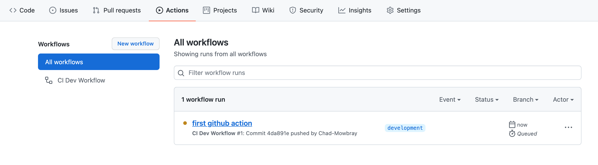
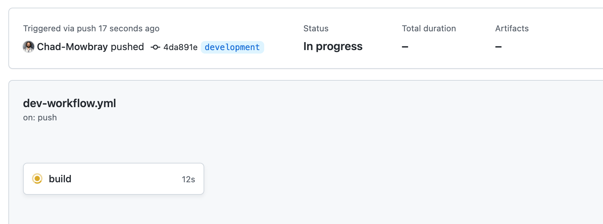
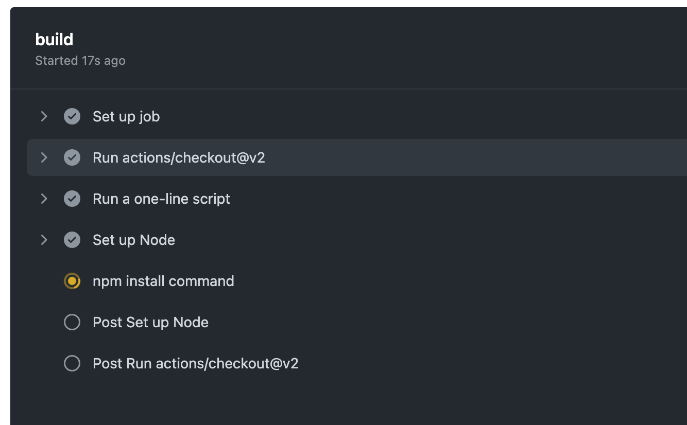

## Group Projects Begin
# Continuous Integration with Github Actions: Coding as a Team

There's a lot you can get away with when you are writing code by yourself, for yourself. But the more people you have working on a codebase, and the more complex that codebase is, the more you need consistency and transparency in the development process.

Today we're going to walk through implementing a system that will (hopefully) mitigate some potential problems that arise when developing code as a team.  We'll make sure that everyone's code contributions run through the same process, and that team members are accountable to each other for those contributions.

The term of art for this automated system is "Continuous Integration and Continuous Delivery (CI/CD)."

Continuous Integration and Continuous Delivery (CI/CD) have become industry standards in software development.  Today we are going to focus on the first term: Continuous Integration.  Continuous Integration basically means setting up "pipelines" (automated processes) to thoroughly test a codebase every time a change is made.

1. You as a developer make some small change to the codebase and submit a PR.
2. Some system (we will be using Github Actions) detects the change.
3. The code (with your changes) is then built from scratch in a fresh environment.
4. If nothing blows up, some initial tests are run (unit tests, linters, etc.)
5. If nothing fails, the changes will undergo further tests with more of the codebase (integration testing).

A given pipeline can be more or less complex depending on a variety of factors.  But the important part is that the process is automated.  This makes the process of changing code transparent and consistent for everyone.  It also makes it more difficult for bugs to creep in and stay hidden.

When working on your group project, this can be a very handy process to have set up.  Every time someone pushes up a PR, the project is built from scratch using the same versions of all the packages, operating systems, etc.  If you set up your testing environment to mirror your production environment (your EC2 instance), this should guarantee that you won't have major surprises when you go to deploy--which you should be doing on a regular basis.  If you also have thorough tests, you can be confident that you are catching problems early on.

A few popular pipeline tools are: [Jenkins](https://www.jenkins.io/), [Concourse](https://concourse-ci.org/), and [CircleCI](https://circleci.com/). Lucky for us, Github now comes with its own CI/CD system: Github Actions.  You can basically think of Github actions as "stuff I want to do every time there's a new push." That stuff you do can be as complicated as you like, but the most basic things you should be doing are building your code and running tests.

### Create a Repo 
As our example we'll use the [docker-compose-app example](https://github.com/deltaplatoonew/docker-compose-app), but any code can make use of Github actions.  Your team will create a new Github repo and push up some initial code.  

### Branch Permissions
From your Github repo under `Settings`, `Collaborators`, add your team members.

From here we are going to do things a little bit differently than we have previously.  We will treat our `master` or `main` branch as sacred, like a "production" branch.  No one will be able to directly push to `master`.  

To protect the `master` branch go to your Github repo, `Settings`, then `Branches`.  Under "Branch protection rules" click on "Add branch protection rule."  Under "Branch name pattern", type in whatever your "production" branch is. Check the "Require pull request reviews before merging" box, and require two reviewers.  Also add "Do not allow bypassing the above settings." This will ensure that no one is unaccountably sneaking in changes to our "production" branch. You should also enable "Require branches to be up to date before merging" under "Require status checks to pass before merging" to minimize merge issues.

If you now try to push to master directly, you should be prevented:
```bash
 ! [remote rejected] master -> master (protected branch hook declined)
error: failed to push some refs to 'https://github.com/Chad-Mowbray/test-github-actions.git'
```

#### NOTE: You should make sure that, before you create a new feature branch, you `git pull` the most recent version of your remote repository.


### Github Actions
Once we have a protected "production" branch, we are going to create a "pipeline" or set of automated actions that will be triggered whenever there is a PR.

All you have to do to start using Github Actions, is create a `.github` folder in your project's root.  Under `.github`, add a `workflows` folder.  In `workflows` you'll create a YAML file that will describe the actions that will be performed.  I've called mine "dev-workflow.yml," but the name doesn't matter.

[YAML](https://yaml.org/) is basically if JSON were Python (tabs instead of curly brackets).  It's quite a bit cleaner-looking. Here is what we will be starting with:


```yaml
# dev-workflow.yml
name: CI for Group Projects

on:
  push:
    branches: [ master ]
  pull_request:
    branches: [ master ]

jobs:
  some-job: ...

```
The two top-level keywords are "on" and "jobs."  `on` describes the event trigger.  In this case, whenever there is a push or PR aginst the `master` branch.

Once the event triggers, the `jobs` will run.  You can have many different jobs.  The name of the job is arbitrary.  We need to tell the job what platform to use as an environment ("ubuntu-latest").

Let's add an actual job:

```yaml
name: CI for Group Projects

on:
  push:
    branches: [ master ]
  pull_request:
    branches: [ master ]

jobs:
  react-tests:
    runs-on: ubuntu-latest
    steps:
    - uses: actions/checkout@v3
    - name: Set Up Node for Frontend
      uses: actions/setup-node@v3
      with:
        node-version: lts/*
    - run: npm ci
      working-directory: ./frontend
    - run: npm run build --if-present
      working-directory: ./frontend
    - run: npm test
      working-directory: ./frontend
```

Jobs are composed of "steps."  Here we are cloning our repo into the new environment, installing Node, then installing our project's dependencies.  Like everything else in software development, there are many people trying to solve the same problems.  Fortunately, some of those people make their solutions available for others to use. ["actions/checkout@v3"](https://github.com/actions/checkout), for example, takes care of cloning our repo.  There are many more available, so [check](https://github.com/marketplace?type=actions) before doing something yourself.  The specifics will differ depending on which action you are using, so check the documentation.

Now that we've added a workflow, when we push up again to a feature branch (remember, we're not pushing directly to `master` anymore), Github Actions will take over and run our pipeline for us.

Click on the "Actions" tab:


Then click on your workflow:


Finally, you should be able to see the detailed logs for your pipeline:


Hopefully, your build passed.  If not, you'll have to go back and troubleshoot (better now than later!).

Let's also add Django tests, and make sure that docker compose spins everything up correctly.

Just one more thing before doing a full run.  Add a `run-compose-dev-ci.sh` script with these contents:

```bash
#!/bin/bash

# These environment variables are consumed by the docker-compose file.
export SECRET_KEY=abc123
export DEBUG=True

docker-compose -f docker-compose.dev.yml up --build -d
sleep 3
docker-compose -f docker-compose.dev.yml down
```

so that your app doesn't just run forever.

```yaml
# dev-workflow.yml
name: CI for Group Projects

on:
  push:
    branches: [ master ]
  pull_request:
    branches: [ master ]

jobs:

  react-tests:
    runs-on: ubuntu-latest
    steps:
    - uses: actions/checkout@v3
    - name: Set Up Node for Frontend
      uses: actions/setup-node@v3
      with:
        node-version: lts/*
    - run: npm ci
      working-directory: ./frontend
    - run: npm run build --if-present
      working-directory: ./frontend
    - run: npm test
      working-directory: ./frontend

  django-tests:
    runs-on: ubuntu-latest 
    steps:
      - uses: actions/checkout@v3
      - uses: actions/setup-python@v4
        with:
          python-version: '3.11' 
      - run: pip install -r requirements.txt 
        working-directory: ./backend
      - run: python manage.py test
        working-directory: ./backend

  run-compose:
    needs: [react-tests, django-tests]
    runs-on: ubuntu-latest
    steps:
    - uses: actions/checkout@v3
    - name: Start containers
      run: ./run-compose-dev-ci.sh
    - name: Stop containers
      if: always()
      run: docker-compose -f docker-compose.dev.yml down
```

Now when pushing up to a branch, the unit tests will run for God and all creation to see. If anything fails, you can make changes and push up a new commit.

From there two (or however many you decide on, but two is probably good) teammembers will give the PR a once-over and either approve or tell you how terrible your code is and how terrible you are as a person for writing such terrible code.

This might seem overkill, but the initial investment you make setting things up will significantly reduce problems down the road.
