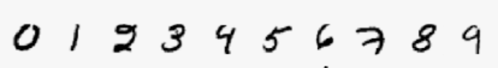
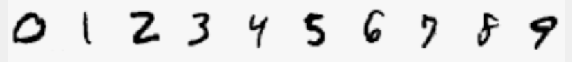
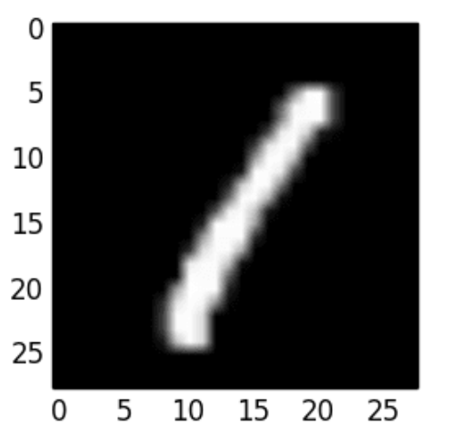

# Machine Learning: Your Computer Is Even Dumber Than You Thought

Despite my poor penmanship, if I wrote down a list of all the digits, you'd have no problem identifying each one:



People are good at using a limited set of observations and extrapolating out to novel instances.  So if I now showed you my friend's list:



you are unlikely to be baffled by it, even though you've never seen a `7` with that _exact_ shape before.

A task which is so easy for humans that we don't even think about it, is extremely difficult to perform correctly using a computer.

But for the sake of the exercise, let's try and figure out how we might get a computer to correctly identify handwritten digits using what we already know about programming.

The first problem is representing our domain in a programming language (Python, from here on).  We can't simply write a function like this:

```python
def give_digit(image):
  return ???
```
The image has to be converted into a Python object of some sort.  We have a few options; you might be experiencing Sudoku flashbacks right about now.  What about this?



At least conceptually, we can break the image down into smaller pieces with a grid.  And a grid can be fairly straightforwardly represented as a 2-dimensional array in Python.  What values might we use to fill up a 2D array?  

For the sake of simplicity, let's assume that a given coordinate is either filled or empty.  This `1` might be represented as:

```python
[
  [0,0,0,0,0],
  [0,0,0,1,0],
  [0,0,1,0,0],
  [0,1,0,0,0],
  [0,1,0,0,0]
]
```

Or something like that.  The level of precision necessary for our application is not obvious right now, but that's the idea.

As an aside, what letter do you think this is?

```python
a_letter = [1,0,0,0,0,0,0,0,0,0,0,0,0,0,0,0,0,0,0,0,0,0,0,0,0,0]
```

OK, now we've outsmarted the computer by translating some real-world object into a Python object.  We can go back and implement the `give_digit` function:

```python
def give_digit(image):
  if image == [
  [0,0,0,0,0],
  [0,0,0,1,0],
  [0,0,1,0,0],
  [0,1,0,0,0],
  [0,1,0,0,0]
]:
    return 1
  elif image == ...
```

Hmm, it looks like we can only identify a `1` if it's written exactly like the example.  No problem, we can just account for all the variations in our function:

```python
def give_digit(image):
  if image == [
  [0,0,0,0,0],
  [0,0,0,1,0],
  [0,0,1,0,0],
  [0,1,0,0,0],
  [0,1,0,0,0]
] or image == [
  [0,0,0,1,0],
  [0,0,0,1,0],
  [0,0,1,0,0],
  [0,1,0,0,0],
  [0,1,0,0,0]
] or image == [
  [0,0,0,1,0],
  [0,0,0,1,0],
  [0,0,1,0,0],
  [0,0,1,0,0],
  [0,1,0,0,0]
]  or ...:
    return 1
```

If the tedium weren't enough, imagine trying to update this or find bugs in it.  What we'd really like to do is hand off the actual implementation of this function to something else, so we don't have to write and maintain it.  A nice shiny black box that just gives us the correct answer (at least most of the time).

[some black boxes](https://scikit-learn.org/stable/)

It turns out that the hardest part of developing a machine learning model is not the actual machine learning--it's figuring out what to give the model.

That scikit-learn documentation shows three different kinds of problems: classification, regression, and clustering.  

Our number interpreter is an example of a classification problem.  We have a finite and discrete set of possible answers: is it a 1, or a 2, or a 3...  Another typical example is a model that answers the question: is this email spam or not spam? 

We won't go into the other types right now, but the same basic principles are generally applicable.

We need 3 basic things 
1. Input
  - The thing we're answering a question about, transformed into (almost always) a list of numbers.  Example: an image of a digit -> a 2D array of 0s and 1s.
2. Output
  - The thing we want to know about the input.  In a classification problem, this is a set of possible answers.  There could be just 2 (spam, not spam), or many more.  You need to know the possible answers in advance (there is also "unsupervised learning," but that's another thing).
3. Model (a black box)
  - A model is basically a function that takes an input and returns an output. But models don't just exist, they have to be "trained" (customized) on data that you give them.

### Training a Model

If you want your digit guessing model to be reasonably accurate, you want to give it as much data as possible.  In the case of a supervised classification model, that training data should be labeled.  In Python, that might look like this:

```python

training_data = [
  [
    [0,0,0,0,0],
    [0,0,0,1,0],
    [0,0,1,0,0],
    [0,1,0,0,0],
    [0,1,0,0,0]
  ],
  "1",
  [
    [0,0,0,1,0],
    [0,0,0,1,0],
    [0,0,1,0,0],
    [0,1,0,0,0],
    [0,1,0,0,0]
  ],
  "1",
  ...
]
```


You might just happen to have a bunch of this data lying around, but more likely you'll have to get it from [somewhere else](https://www.kaggle.com/competitions/digit-recognizer/data).  And whereever you get it from, you'll have to do some thinking, cleaning and processing to get the original data into the shape you need it.  This is 90% of the work.

How do you know if you have enough data?  It's hard to say, but it's never enough.  The simpler the input/output, the less you need.


### [A Mini Example Walkthrough](https://github.com/deltaplatoonew/Complaining-Customers)

### [X or O: A Very Exciting and Useful Machine Learning Web Application](https://github.com/deltaplatoonew/X-or-O)

