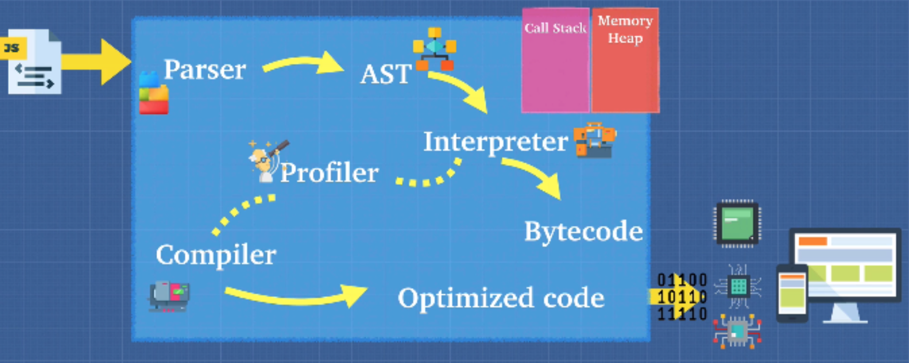
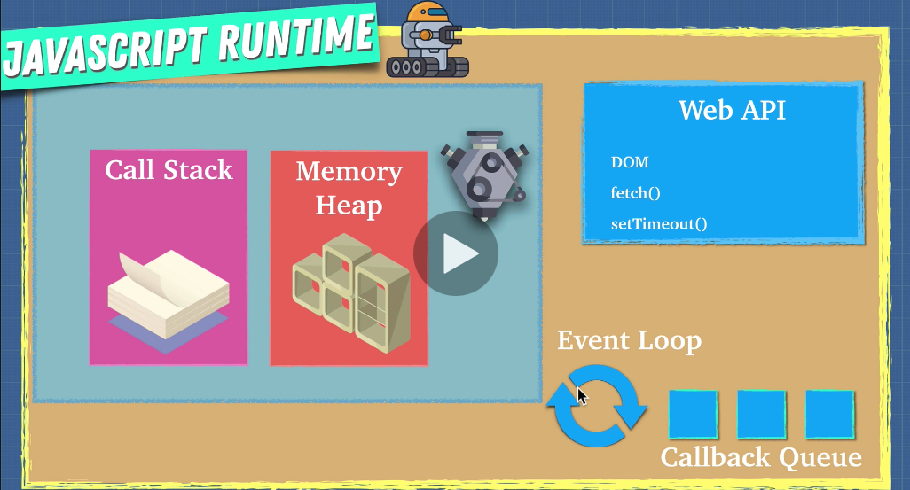

Thursday, October
 6, 2022
=====================
### Video Resources from Previous Cohorts
- [Videos](https://www.youtube.com/channel/UCASZ7zW_Egu0T4KG3YEdGfw/playlists)

### Lecture Topics
- JS Fundamentals
- Javascript Runtimes


**Javascript Fundamentals**
- Javascript was created by Brendan Eich during his time at Netscape in 1995 that conforms to the ECMAScript specification.
- JavaScript is one of the core technologies of the World Wide W,eb.
- JavaScript is high-level language. It has curly-bracket syntax, dynamic typing, prototype-based object-orientation, and first-class functions.
- With the creation of Node.js (by Google) you can leverage Javascript to write server side code

**Data Types**
  - **Strings**
    - Anything enclosed in single, double quotes, or back ticks
    ```js
      'stringOne'
      "string two is also a string with 123456789"
      `Use back ticks for string interpolation to put variables in your string ${someVariable}`
    ```
    - Interpolation is when you substitute a variable into a string.
    ```js
    let firstName = 'Tom';
    console.log(`My first name is ${firstName}`)
    ```

    - Reference [MDN](https://developer.mozilla.org/en-US/docs/Web/JavaScript/Reference/Global_Objects/String) and [W3 Schools](https://www.w3schools.com/js/js_string_methods.asp) for a list of built-in String Methods
  - **Numbers**
    - Similar to most other languages, `integers` are whole numbers, `floats` are decimals
    ```js
    3.14 //-> Float number
    55 //-> Integer is a whole number
    ```
  - **Booleans**
    - Booleans are `true` or `false`
    ```js
    true
    false
    ```
  - **Undefined**
    - A variable may have a value but it's currently not defined.
    ```js
    let babyName = undefined;
    ```
  - **Null**
    - A variable explicity has no value
    ```js
    let noValue = null
    ```
  - **Arrays**
    - Holds an ordered list of values. These values can be anything: strings, numbers, objects, even other arrays!
    - Once you put something in an array, it stays at that place forever until you alter the array. You can rely on it always being there. Think of an older person's pill box - the pills for Monday are in the Monday slot. If they were to shake it or drop it or something, it wouldn't matter. Those pills are still at the same place.
    - You can access the values in the array by using their `index`. We start counting from 0 and go up from there
    ```js
    const daysOfTheWeek = ['mon', 'tues', 'wed', 'thurs', 'fri']
    // Remember, computers start counting at 0 and move up from there
    daysOfTheWeek[3] // "thurs"
    ```
    - Reference [MDN](https://developer.mozilla.org/en-US/docs/Web/JavaScript/Reference/Global_Objects/Array) and [W3 Schools](https://www.w3schools.com/jsref/jsref_obj_array.asp) for a list of built-in Array Methods

  - **Objects**
    - It's a collection of key/value pairs. You can't access it by `index` like with arrays because objects do not have an order, but you can access it by `key`
    - Useful for things like VIN numbers or social security information where the keys are completely unique
    ```js
    // below, we have a object called user that has a name/age key on the left and values on the right
    let user = {
        'name': 'Tom',
        'age': 34
    }


    // To access a particular key's value:
    console.log(user['name'])

    // You can also re-assign a key's value
    user['age'] = 30
    ```

**Variables**
  - Variables are named labels/identifiers for storing values
  - Remember from math class variables “x” and “y”?
  - There are three ways to declare/create a variable in Javascript
  - `var`
    - The most common variable. It can be reassigned but only accessed within a function. Variables defined with `var` move to the top when the code is executed. (don’t use anymore)
  - `const`
    - Can not be reassigned and not accessible before they appear within the code.
  - `let`
    - The `let` variable can be reassigned but not re-declared.

  - `var`, `let`, and `const` are reserved keywords in Javascript. You can’t use them for anything other than declaring variables

**Printing**
- `console.log()`
- Takes whatever you give it and prints it to the terminal/console
```js
let a = 'Hello'
let b = 'World'
console.log(`${a} ${b}`) //-> 'Hello World'
```

**Arithmetic Operators**
- Arithmetic is pretty much the same in all languages. Below are all of the operators:

|Description|Operator|Examples|
|-----------|--------|--------|
|Addition| `+`| `1 + 1 //-> 2`|
|Subtraction|`-`| `3 - 2 //-> 1`|
|Multiplication|`*`| `3 - 2 //-> 1`|
|Exponent|`**`| `3 ** 2` (‘3 to the power of 2’)|
|Division|`/`| `10 / 2 //-> 5`|
|Modulus (returns the remainder)|`%`| `10 % 3 //-> 1`|

**Logic Operators**
|Description|Operator|Examples <br>`let a = 4;`<br> `let b = 2;`<br>`let c = 8`|
|-----------|--------|--------|
|Equal| `==` or `===`| `a == b //-> false`|
|Not equal|`!=` or `!==`| `a !== b //-> true`|
|Greater than|`>`| `a > b //-> true`|
|Less than|`<`| `a < b //-> false`|
|Greater than or equal|`>=`| `a >= b //-> true`|
|Less than or equal to|`<=`| `a <= b //-> false`|
|Logical AND|`&&`| `a > b && b < c //-> true` <br> `a > c && a > b //-> false`|
|Logical OR|`\|\|`| `a > b \|\| b < c //-> true` <br>`a > c \|\| a > b //-> true`|


**Functions**
- Javascript functions are resusable blocks of code that perform a specific set of instructions
- Functions output a value

```js
// To declare a new function use the function keyword followed by the name of the function.
// Pass in parameters (if needed)

// Regular functions
function name(parameter1, paramenter2) {
	let answer = parameter1 + paramenter2
	return answer
}

// OR

// ‘Fat arrow’ functions
const name = (num1, num2) => {
  let answer = num1 + num2
  return answer
}

// Example
let sayHello = (firstName) => {
  return `Hello! My name is ${firstName}`
}

sayHello('Tom')
// Here we have a function called `sayHello` that takes in a single parameter/argument called `firstName`. We passed in `Tom` as the argument, so `Tom` gets saved as `firstName` when we run through the code. We can then interpolate `firstName` into the string that gets printed out.

```

**Conditional Logic**
- When you want to control how a computer goes through your program, use control flow!
- Evaluates to either true or false (boolean values)
- Allows us to select different outcome depending on user input or the result of a computation

```js
// if statement
if (a === b) {
	// do something
}

// if else statement
if (a === b) {
	// do something
} else {
	// do something
}

// else if statement
if (a === b) {
	// do something
} else if (a > b) {
	// do something else
} else {
	// do something else
}
```
- **Example**
```js
let age = 18
if (age >= 21) {
    console.log('Welcome to the bar')
} else {
    console.log('Come back when you are older')
}

# Sometimes, you can drink if you are in another country if you're 18. Let's account for that.

let currentCountry = 'China'
if (age >= 21) {
    console.log('Welcome to the bar')
} else if  (age >= 18 && currentCountry === 'China') {
    console.log('You can drink in China starting at age 18!')
} else {
    console.log('Come back when you are older')
}
```

**Iteration (Loops)**
- Loops are very popular in coding. They are basically instructions for your computer to do things over and over again
- As long as the condition is true, the block of code will continue to execute.
- When the condition becomes false, the code after the end of the loop will be executed.
```js
let age = 12
while (age < 21) {
    console.log(`You are not old enough yet - you are only ${age} years old! Come back when you are older.`)
}
// beware of infinite loops! What is going on above?

// This would be better:
let age = 12
while (age < 21) {
    console.log(`You are not old enough yet - you are only ${age} years old! Come back when you are older.`)
    age += 1
}
```
- `for` loops are a bit different. It's a way for you to iterate over everything in an array or object

```js
let age = 12
for (let i = 0; i < 21; i++) {
  console.log(`You are not old enough yet - you are only ${age} years old! Come back when you are older.`)
}
return `You're now ${age}! You can come on in!`

// Looping through an object
let employee = {
  name: 'Tom',
  title: 'Instructor'
}
for (let key in employee) {
	// execute this code
}
return someValue
```


## Javascript Runtimes: Node vs. The Browser
If you are going to be a Javascript programmer, it would be good to know a thing or two about how Javascript actually runs.

Javascript on its own really doesn't do much.  The first thing Javascript needs is an "engine."  The engine does all the work to transform Javascript code into something your computer actually understands.  [Google's V8 engine](https://v8.dev/) (written in C++!) is currently the dominant one (and the one Node uses).  Here's an overview of how the V8 engine works:<br/>



Like any other high level language, Javascript first needs to be transformed into something that a computer can actually understand--machine code.  This is a complex process, but the short version is that the Javascript code that you write is first "parsed", and "tokenized."  A line of Javascript
```javascript
const myNum = 5
```
will end up becoming four different items, or "tokens," (`const`,`myNum`,`=`,`5`) with appropriate labels.  All of those tokens will then be formed into something called an "abstract syntax tree" or AST.  A tree is a data structure (more on those later in the course) that represents the relationship among individual elements called "nodes" (in this case tokens). [Go here](https://astexplorer.net) if you want to see an example.

If that seems like quite a lot of extra stuff, you're not alone.  But even the engine is not enough to really run Javascript.  You need a full Javascript runtime, of which the engine is only a part: <br/>


The runtime gives us access to all the features that make (timeouts, HTTP requests, etx.) Javascript really useful.  While there are standards, each browser is really its own runtime.   And until 2009, browsers were the only Javascript runtime environments available.  What happened in 2009?  [Node.js](https://nodejs.dev/learn/a-brief-history-of-nodejs).  Written in C and C++, Node provides the scaffolding that useful Javascript applications need to run outside the browser.

However, there are some minor differences between running Javascript in a browser and using Node as a runtime.

### Some Differences Between Node and the Browser
- `window` vs. `global`
- `prompt` vs. ???
- reading files?

Feel free to explore the differences, but don't get to hung up on them.  The basics of Javascript are the same regardless of runtime.


### Challenges
* [Linear Search](https://github.com/deltaplatoonew/linear-search)
* [99 Bottles](https://github.com/deltaplatoonew/99-Bottles)

### Additonal Resources
* [Wikipedia of Algorithms](http://algorithm.wiki/en/app/)
* Some of you may be wondering what `exports` is on the Javascript files. The Javascript folders will sometimes have prewritten spec (test) files and in order for the spec file to read the contents of the corresponding Javascript files where your code is written, it must be attached to the `export` Javascript object. To ensure that you are writing correct code, run `node WHATEVER_CHALLENGE_NAME_Spec.js` in the `js` folder. Don't run `node WHATEVER_CHALLENGE_NAME.js` as it will blow up.
