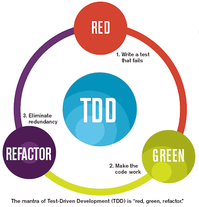

Saturday, October 8, 2022
=====================
### Video Resources from Previous Cohorts
- [Videos](https://www.youtube.com/channel/UCASZ7zW_Egu0T4KG3YEdGfw/playlists)

### Lecture Topics
- Test Driven Development (TDD)
- Unit testing with [Jest](https://jestjs.io/docs/getting-started)

## Test-Driven Development
Test-driven development (TDD) is the process of writing tests before you write any code. It's an important part of Agile software development and leads to better software for a number of reasons. The two that are most prominent:
1. As a developer, you are forced to think through what your program is supposed to do before you start writing code. It guarantees that whatever you write does what you want and accounts for edge cases.
2. It ensures that the code that you write integrates well into your overall program so that it doesn't break everything.

TDD is a devopment cycle that repeats over and over again: Red, Green, Refactor: 

- Red - Think of some small bit of functionality that your program needs.  Write a test that describes that expected functionality.
- Green - Write the minimum amount of code required to pass that test.
- Refactor - Take another look at your code and see if anything can be improved.

Each language has its own testing frameworks. As developers, you'll be required to primarily write Unit Tests. Unit Tests are pieces of software that call methods/functions you write and see if they work as you expect. When you write a method, you want to test it to ensure that it does what you expect. You are essentially testing a single **unit** of code in isolation and making sure it gives you what you want.

For Javascript, we will be using [Jest](https://jestjs.io/docs/getting-started), but feel free to explore other options if you would like.

[FizzBuzz example](https://github.com/deltaplatoonew/fizzbuzz_TDD)

### Challenges
* [Factorial](https://github.com/deltaplatoonew/factorial)
* [Roman Numerals](https://github.com/deltaplatoonew/roman-numerals)

### Pair Challenge
* [Deaf Grandma](https://github.com/deltaplatoonew/deaf-grandma) in Javascript

### Additonal Resources
* [TDD](https://www.agilealliance.org/glossary/tdd)
* [TDD example](http://butunclebob.com/ArticleS.UncleBob.TheBowlingGameKata)
