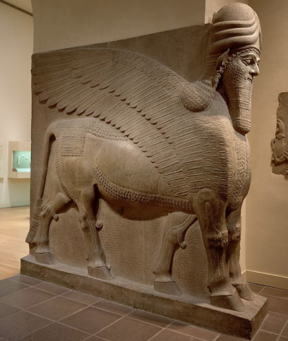

Tuesday, October 18, 2022
====================
### Video Resources from Previous Cohorts
- [Videos](https://www.youtube.com/channel/UCASZ7zW_Egu0T4KG3YEdGfw/playlists)

### Lecture Topics
- Class Composition


## Composition
---
If inheritance can be described as an "is-a" relationship (`Programmer` "is-a" `BasicEmployee`), then composition can be described as a "has-a" relationship.

Meet Lamassu:<br/>


Lamassu is an Assyrian immigrant and retired palace guard who enjoys feeding pigeons and watching <i>The Price is Right</i> reruns.

Lamassu "has-a" bull body, "has-a" wing, and "has-a" human head.  Don't ask me what he <i>is</i>.

How could we represent such an uncommon creature with classes?  We could certainly try inheritance, but there might not be very much that Lamassu has in common with other animals.

Another approach is to use composition.  Let's try it out:

```python
class Wings:
    def __init__(self, num):
        self.num_of_wings = num

class Body:
    def __init__(self, girth, kind):
        self.girth = girth
        self.kind = kind

class Head:
    def __init__(self, kind):
        self.kind = kind

class Lamassu:
    def __init__(self, body_parts):
        self.body_parts = body_parts
```

The first three classes are body parts, and the fourth class is `Lamassu`.  You can make a `Lamassu` from all kinds of parts.

Let's make one:
```python
wings = Wings(2)
body = Body("very much so", "Bull")
head = Head("Human")

lam = Lamassu([wings, body, head])
```

Lamassu <i>has</i> all these things, but <i>is</i> not any of them.  Still, Lamassu can use all of his parts:
```python
print(lam.body_parts[1].girth)
```

## Challenges
* [Mode](https://github.com/deltaplatoonew/calculate-mode)
* [Boggle](https://github.com/deltaplatoonew/boggle)
