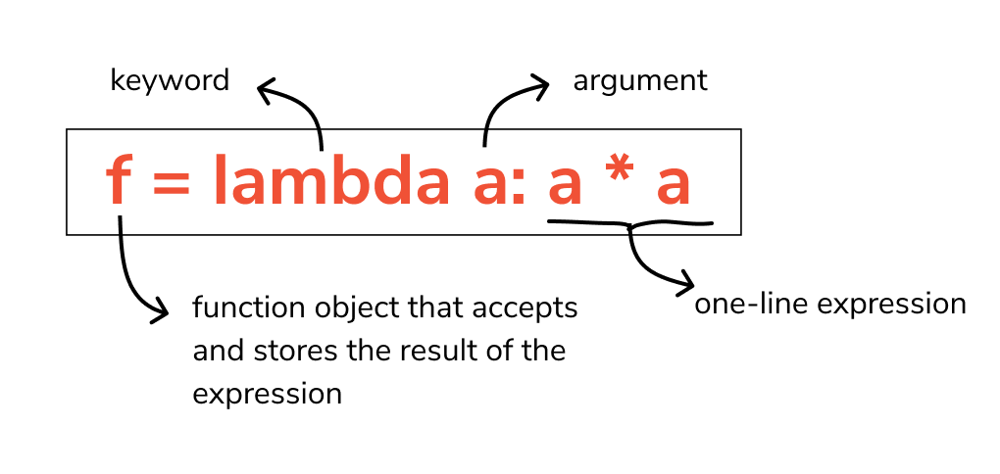
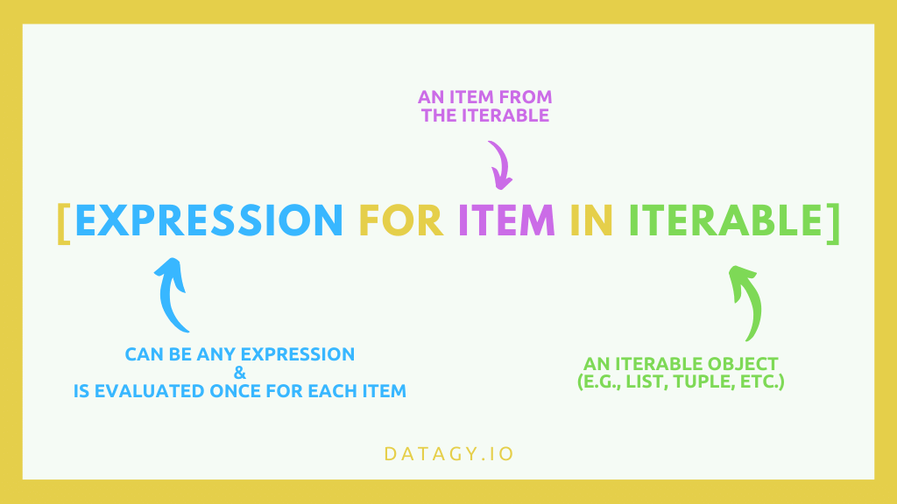

Thursday, October 27, 2022
=======================
### Video Resources from Previous Cohorts
- [Videos](https://www.youtube.com/channel/UCASZ7zW_Egu0T4KG3YEdGfw/playlists)

### Lecture Topics
- Lambda Functions
- List Comprehensions

# Lambdas and List Comprehensions
One of the ideals of the Functional Programming paradigm is to create code that is "declarative" rather than "imperative." These are somewhat fuzzy and relative concepts, but, in general, declarative code operates at a higher level of abstraction.  Like a good manager, you use your code to describe (or "declare") what you want and leave the implementation details to lower levels.  Imperative code, on the other hand, is like a micromanaging boss who instructs his subordinates exactly how to go about doing what he wants.

That might sound a little too abstract, but let's look at a brief example to see what that looks like.

Let's say we start out with a list of numbers:
```python
nums = [1,2,3,4,5]
```
Declarative code would look something like this:
- "Give me a new list of doubled values"

In contrast, Imperative code would be quite a bit more verbose:
- "Create a new empty list"
- "Iterate over the original list"
- "For each iteration, assign the current value to a variable"
- "Double the current value"
- "Append the current value to the new list"
- "Return the new list"

Let's translate the two approaches into code.

Declarative:
```python
doubled = [num * 2 for num in nums]
```

Imperative:
```python
doubled = []
for num in nums:
  num = num * 2
  doubled.append(num)
```

So which implementation is better?  As always, that depends.  However, you are more likely to find the declarative implementation in professional quality code bases.

Python (and Javascript, of course) provides a number of tools to help you write more declarative code.  We are going to look at some of those now.

## Lambda Functions
In Python, a `lambda` function is basically a more concise way of writing a function.  It is similar to an arrow function in Javascript:

Javascript identity function:
```javascript
const myFunc = x => x
```

Here is the same function in Python:
```Python
my_func = lambda x: x
```

As with Javascript arrow functions, Python `lambda`s are anonymous.  One consequence of anonymity manifests in stack traces.

Printing anonymous functions:
```python
x = lambda x: x
y = lambda x: x + 1
print(x, y)
# <function <lambda> at 0x10513b1f0> <function <lambda> at 0x10513b4c0>
```

If there were an error, how would we know which anonymous function it occured in?

Before we get too far along, we should describe the syntax of a `lambda` function.<br/>


You have to start with the `lambda` keyword.  That is followed by the parameters (multiple parameters are comma-separated):
```python
lambda a,b,c: a + b + c
```
After the parameter(s), you need a colon.  Following the colon is the expression.  A `lambda` function can only have one expression--so no `for` loops or other complicated logic.

### `lambda` usage
`lambda`s are often used when you need a simple, one-time function.  For example, let's say we want to sort a list of tuples:

```python
from random import randint as r
from random import choice as c
from string import ascii_lowercase as l
rand_tups = [(r(0,10),c(l))for _ in range(10)]
rand_tups.sort()
print(rand_tups)
# [(0, 'i'), (0, 'j'), (1, 't'), (3, 'h'), (3, 'i'), (4, 'c'), (6, 'q'), (7, 'g'), (7, 'l'), (10, 's')]
```
By default, Python's `sort` method will sort based on the first element of a tuple.  But what if we want to sort by the second element instead?  `sort` accepts an optional keyword argument called...`key`. The value of `key` should be a function that allows you to customize the sorting criterion.

Sorting on the second element:
```python
from random import randint as r
from random import choice as c
from string import ascii_lowercase as l
rand_tups = [(r(0,10),c(l))for _ in range(10)]
rand_tups.sort(key=lambda pair: pair[1])
print(rand_tups)
# [(3, 'c'), (3, 'e'), (7, 'g'), (7, 'l'), (0, 'p'), (3, 'p'), (0, 'r'), (3, 'r'), (1, 's'), (8, 'z')]
```

We could have written a regular Python function and passed it in as `key`, but the `lambda` is short and sweet.  Is short and sweet better?...It depends.

Despite its shorness and sweetness, `lambda` functions have their limitations, and detractors.  This somewhat tongue-in-cheek comment is found in the [official Python docs](https://docs.python.org/3/howto/functional.html):

>Fredrik Lundh once suggested the following set of rules for refactoring uses of lambda:
>1. Write a lambda function.
>2. Write a comment explaining what the heck that lambda does.
>3. Study the comment for a while, and think of a name that captures the essence of the comment.
>4. Convert the lambda to a def statement, using that name.
>5. Remove the comment.

## List Comprehensions
We've just seen several list comprehensions.  Here is the basic syntax:<br/>


One thing you can do with list comprehensions is make a copy of a list:
```python
original = [1,2,3,4]
copy = [num for num in original]
print(id(original), id(copy))
# 4477319424 4477967104
```

What if we wanted our copy to filter certain values?  We can do that with list comprehensions as well:
```python
original = [1,2,3,4]
filtered_copy = [num for num in original if num % 2 == 0]
print(original, filtered_copy, sep='\n')
# [1, 2, 3, 4]
# [2, 4]
```

List comprehensions can also be a lot more complex.  We won't get too far into the weeds, but here is an example list comprehension that flattens a 2D array:
```python
array_2D = [
  [1,2,3],
  [4,5,6],
  [7,8,9]
]
flattened = [cell for row in array_2D for cell in row]
print(flattened)
```
Note the strange order of elements.  As with `lambda` functions, you'll have to weigh simplicity, convenience, and readability when choosing your tool.

While the title of this section is "List Comprehensions," Python allows you to make comprehensions from other data types as well.  Here is a dictionary comprehension:

Create a random dictionary:
```python
from random import randint as r
from random import choice as c
from string import ascii_lowercase as l
rand_dict = {c(l):r(0,10) for _ in range(10)}
print(rand_dict)
# {'h': 4, 'c': 5, 'k': 0, 'f': 5, 'n': 8, 'q': 4, 'j': 0}
```
Aside:  Why does this particular `rand_dict` only have 7 entries?  What are the requirements for keys?

### Challenges
* [Stock Picker](https://github.com/deltaplatoonew/stockpicker)
