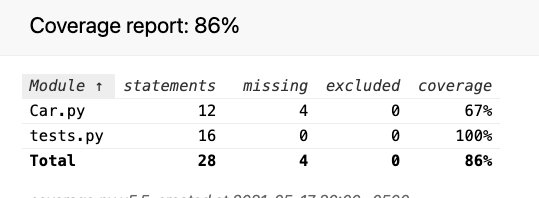
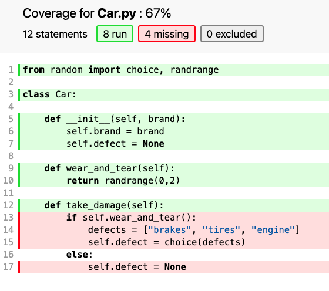
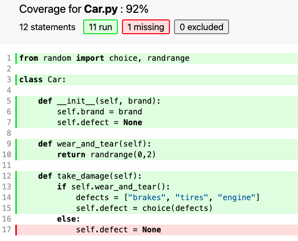
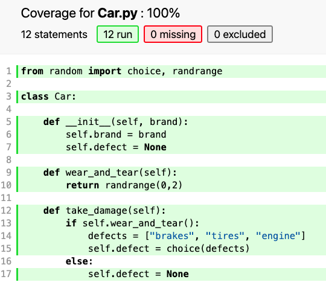

Monday, November 14, 2022
=======================
### Video Resources from Previous Cohorts
- [Videos](https://www.youtube.com/channel/UCASZ7zW_Egu0T4KG3YEdGfw/playlists)


### Lecture Topics
- Code Coverage
- Review of Inheritance in Python


## Code Coverage
How do you know when you are done writing unit tests?  That's a difficult question to answer definitively, but a necessary, if not sufficient, condition would be executing every line of your source code.

Let's say I have a function and I want to check that it returns the correct value:

```python
def double_odd(num):
    if num % 1 == 0: return num * 2
    return num

print(double_odd(3) == 6)
print(double_odd(99) == 198)
```

There are a couple tests, and they both pass, so it must work.  The problem here, of course, is that our tests are never running the second conditional branch.

Because this is such a short piece of code, the problem is obvious.  But imagine trying to check every nook and cranny of a larger codebase by hand...

Fortunately, we can automate the hard work of checking what part of our code is being exercised by our tests.  [Coverage](https://coverage.readthedocs.io/en/coverage-5.5/) is a third-party library that analyzes your code and gives you a helpful display showing you any oversights in your tests.

Let's start with a sample application that models a car that might need to be taken to a mechanic:

```python
# Car.py
from random import choice, randrange

class Car:

    def __init__(self, brand):
        self.brand = brand
        self.defect = None

    def wear_and_tear(self):
        return randrange(0,2)

    def take_damage(self):
        if self.wear_and_tear():
            defects = ["brakes", "tires", "engine"]
            self.defect = choice(defects)
        else:
            self.defect = None
```
And here are our unit tests so far:
```python
# tests.py
import unittest
from unittest.mock import patch
from Car import Car

class CarTests(unittest.TestCase):

    def setUp(self):
        self.c = Car("Toyota")

    def test_car_creation(self):
        self.assertEqual(self.c.brand, "Toyota")
        self.assertIsNone(self.c.defect)

    def test_wear_and_tear(self):
        with patch("Car.randrange") as fake_randrange:
            fake_randrange.return_value = 0
            self.assertEqual(self.c.wear_and_tear(), 0)
            fake_randrange.assert_called_once_with(0,2)

if __name__ == "__main__":
    unittest.main()
```
Rather than checking every line by hand, let's use `coverage` to do it for us.  First we install it:

```bash
python -m venv myvenv
source myvenv/bin/activate
pip install coverage
```
Then we run it (there are a lot of modifications we can make, but we'll stick with the defaults for now):
```bash
coverage run tests.py
```
That command should generate a file called `.coverage`, which is actually a sqlite database containing all the analyzed data about your code.  In order to actually see it, you can run this:

```bash
coverage html
```
You should now see a folder called `htmlcov`.  Inside `htmlcov` open the `index.html` file in a browser.  It should look something like this:<br/>


Click on `Car.py` to get a detailed view:<br/>


Now it is clear what our next unit test should cover:
```python
# tests.py
import unittest
from unittest.mock import patch
from Car import Car

class CarTests(unittest.TestCase):

    def setUp(self):
        self.c = Car("Toyota")

    def test_car_creation(self):
        self.assertEqual(self.c.brand, "Toyota")
        self.assertIsNone(self.c.defect)

    def test_wear_and_tear(self):
        with patch("Car.randrange") as fake_randrange:
            fake_randrange.return_value = 0
            self.assertEqual(self.c.wear_and_tear(), 0)
            fake_randrange.assert_called_once_with(0,2)

    def test_damage_taken(self):
        with patch("Car.randrange") as fake_randrange:
            fake_randrange.return_value = 1
            with patch("Car.choice") as fake_choice:
                fake_choice.return_value = "brakes"
                self.c.take_damage()
                self.assertEqual(self.c.defect, "brakes")
                fake_randrange.assert_called()


if __name__ == "__main__":
    unittest.main()
```
And if we run coverage again:<br/>


Now let's fill that last gap:
```python
# tests.py
import unittest
from unittest.mock import patch
from Car import Car

class CarTests(unittest.TestCase):

    def setUp(self):
        self.c = Car("Toyota")

    def test_car_creation(self):
        self.assertEqual(self.c.brand, "Toyota")
        self.assertIsNone(self.c.defect)

    def test_wear_and_tear(self):
        with patch("Car.randrange") as fake_randrange:
            fake_randrange.return_value = 0
            self.assertEqual(self.c.wear_and_tear(), 0)
            fake_randrange.assert_called_once_with(0,2)

    def test_damage_taken(self):
        with patch("Car.randrange") as fake_randrange:
            fake_randrange.return_value = 1
            with patch("Car.choice") as fake_choice:
                fake_choice.return_value = "brakes"
                self.c.take_damage()
                self.assertEqual(self.c.defect, "brakes")
                fake_randrange.assert_called()

    def test_damage_none(self):
        with patch("Car.randrange") as fake_randrange:
            fake_randrange.return_value = 0
            self.c.take_damage()
            self.assertIsNone(self.c.defect)

if __name__ == "__main__":
    unittest.main()
```


Complete coverage!  Don't get too cocky though.  Having full coverage doesn't necessarily mean that your tests are good, but it's a great way to guide you if you aren't quite sure what to test next.


### Inheritance Review
Inheritance is a relationship between two classes. Think of your relationship with your parents. All your features are inherited from them - your race, eye color, hair color, height, weight to some extent. But you are also very different from them. You have some different features and can do different things (methods) than them. Similarly in coding, let's say we have two classes - a parent and child class. A child class has the ability to inherit all the features of a parent class and any number of methods from the parent class can be overriden in the child class.

A good way to think about this is `is-a`. Think of a parent class called Dog for example - what are some attributes to every dog and some methods available to every dog?

```python
class Dog:
    def __init__(self, name, coat_color):
        self.name = name
        self.coat_color = coat_color

    def tell_me_about_yourself(self):
        print(f"My name is {self.name} and my coat color is {self.coat_color}")

    def bark(self):
        print("BARK")

    def eat(self):
        print("NOM NOM")

d1 = Dog('Spot', 'black')
d1.tell_me_about_yourself()
d1.bark()
d1.eat()
```
In the example above, we say that every dog has an attribute called `name` and `coat_color`. Every dog also has the ability to `tell_me_about_yourself`, `bark`, and `eat`. If `Dog` class is a parent class, then any breed of dog `is_a` child of that `Dog` parent class and can `inherit` things form it. Let's say that we have a Poodle class:

```python
class Poodle(Dog):
    pass

d2 = Poodle('Lucky', 'yellow')
d2.tell_me_about_yourself()
d2.bark()
d2.eat()
```
If you were to run the code above, we would see that the `Poodle` child class has the ability to do everything the Dog can do, despite having none of the code there! The `(Dog)` next to `class Poodle` is what does this for us. We can also overwrite the `bark` and `eat` method on the Poodle class, since Poodles are better behaved than their parent:
```python
class Poodle(Dog):
    def bark(self):
        print('Bark')

    def eat(self):
        print('Nom Nom')

d2 = Poodle('Lucky', 'yellow')
d2.tell_me_about_yourself()
d2.bark()
d2.eat()
```

Finally, we need to talk about the concept of `super`. `super` is when you want to bring in the method of the parent class into the child class, but you also want to add in something else. Let's take a look at the following code:

```python
class Employee:
    number_of_employees = 0

    def __init__(self, first_name, last_name, pay):
        self.first_name = first_name
        self.last_name = last_name
        self.pay = pay
        self.email = f"{first_name}.{last_name}@email.com".lower()
        Employee.number_of_employees += 1 # This line will increase the class variable "number_of_employees" across all instances of the Employee class

    def tell_me_about_yourself(self):
        print(f"My name is {self.first_name} {self.last_name} and my email address is {self.email}. I get paid ${self.pay} a year")


e1 = Employee('Rod', 'Levy', 100000)
e1.tell_me_about_yourself()
```

As software developers, we always have to talk about the language we program in. Let's create a `Developer` child class that inherits from `Employee`:
```python
class Developer(Employee):
    def __init__(self, first_name, last_name, pay, language):
        super().__init__(first_name, last_name, pay) # This is so that you don't need to do all of those `self.first_name = first_name` things again.
        self.language = language

    def tell_me_about_yourself(self):
        print(f"My name is {self.first_name} {self.last_name} and my email address is {self.email}. I get paid ${self.pay} a year. I program in {self.language}.")

e2 = Developer('Josh', 'Alletto', 120000, 'Python')
e2.tell_me_about_yourself()
```

### Challenges
* [School Interface Two](https://github.com/deltaplatoonew/school-interface-two)
