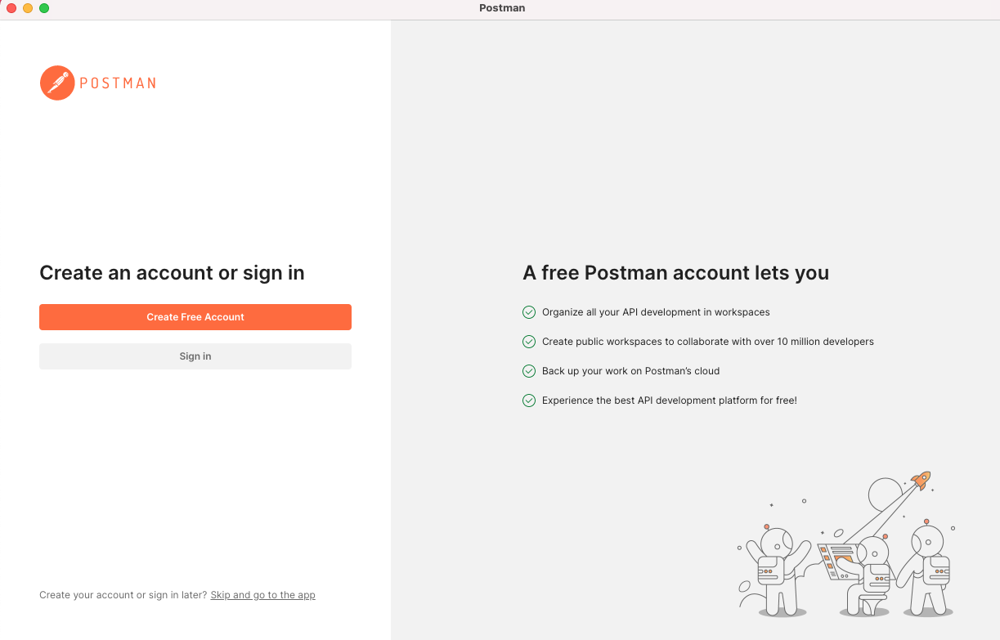
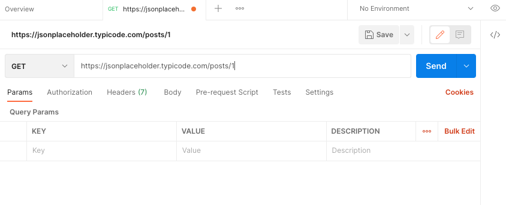
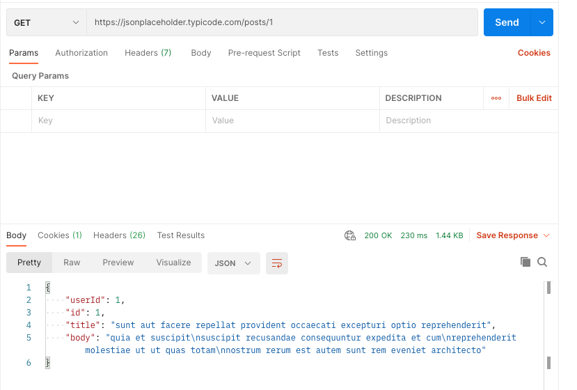
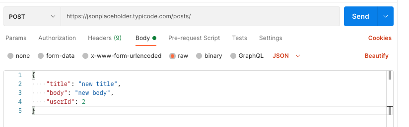
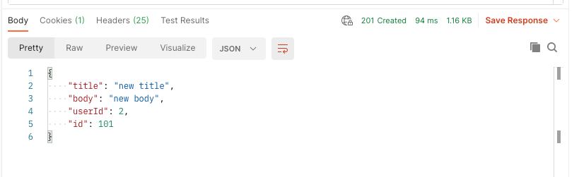

Monday, December 12, 2022
====================
### Video Resources from Previous Cohorts
- [Videos](https://www.youtube.com/channel/UCASZ7zW_Egu0T4KG3YEdGfw/playlists)

### Lecture Topics
- HTTP Clients
- cURL, Postman

## cURL
[cURL](https://curl.se/book.html) is a command line utility that will pretty much be on any Unix-based sytem.  It is a convenient and easy-to-use tool that can come in handy during web-development.  It can be run in scripts or in one-off commands, like any other command line tool.

Here are some basic things you can do
* Make a GET request and get the HTML:
```bash
curl www.example.com
```
* For a simple site like www.example.com, you can immediately run your own copy locally:
```bash
curl www.example.com > myExampleSite.html && open myExampleSite.html
```
* You can also get a more detailed look at what is happening (including the request and response headers) by using the "verbose" flag:
```bash
curl -v  www.example.com
```
* If you really want to go nuts with detail, you can actually see every single byte in hexidecimal numbers.  This will be saved to a file (in this case called "dumpFile"):
```bash
curl --trace dumpFile  www.example.com
```
* And if you really, really have a thing for numbers and letters, you can see the TLS handshake process play out when you go to a secure site:
```bash
curl --trace dumpFile  https://www.duckduckgo.com
```

## Postman
[Postman](https://www.postman.com/downloads/) is a widely used tool for testing and developing APIs.  Like cURL, it enables you to make requests to endpoints without using a browser.  You might find that it makes development and debugging easier.

When you first open the application, you will probably see this screen:<br/>


For now, I'll just skip the sign in.

You can make a request to any URL (including localhost).  We'll use [everyone's favorite dummy API](https://jsonplaceholder.typicode.com):<br/>


Our GET request returns JSON (but HTML works fine too), and we can see it at the bottom of the window:<br/>


We can also make POST requests.  There are a lot of options for sending data.  Here we're typing in our own JSON object (according to the API's specifications):<br/>


And here is the response:<br/>


We get a lot of information about the response, including: status (201 Created), time, headers, cookies.  This information can be extremely handy when developing.


## Team Exercise
- [Build an application using free APIs](https://github.com/deltaplatoonew/two-apis)

