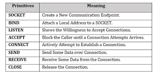
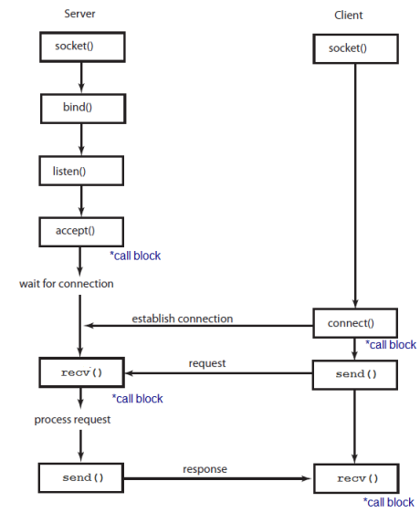

Tuesday, December 13, 2022
====================
### Video Resources from Previous Cohorts
- [Videos](https://www.youtube.com/channel/UCASZ7zW_Egu0T4KG3YEdGfw/playlists)

### Lecture Topics
- Network Tools (network tab, tcpdump)
- HTTP Protocol

## The Berkeley Sockets API
The Python [socket](https://docs.python.org/3/library/socket.html) module is an implementation of the [Berkeley Sockets API](http://networkprogrammingnotes.blogspot.com/p/berkeley-sockets.html).

Here are the basic methods (these include both client and server): 

Here is a network diagram showing how clients and servers interact: 

## HTTP
* [Slides](https://docs.google.com/presentation/d/18XgB39IqvBFXfJYKQdc5j2ZzlZBeOH_enugni6b__Cs/edit?usp=sharing)

## Challenges
* [HTTP Server One](https://github.com/deltaplatoonew/http-server-one)
