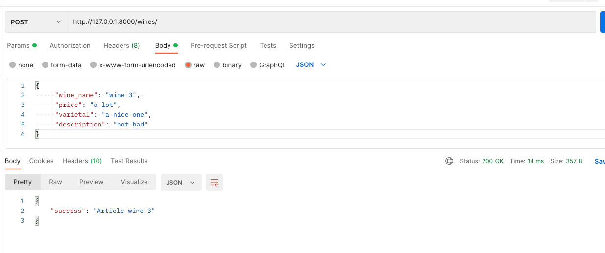

Monday, February 13, 2022
=====================
### Video Resources from Previous Cohorts
- [Videos](https://www.youtube.com/channel/UCASZ7zW_Egu0T4KG3YEdGfw/playlists)

## Topics Covered
**Using Django as an API**
- Full-stack applications that utilize different backend and frontend languages have to connect through an API

**Serializers**
- In order to send a python object to the front end we need to translate an instance of an object into another format to send to the react frontend.

## Goals
**Core**
 - Know how to send Python data from Django to React frontend.
 - Convert Python Class Object to JSON through a serializer

**Stretch**
 - Using the Django Rest Framework to serialize data

## Lesson
**Using Django As An API**
So far we've been using Django to create full stack web applications. This type of app, where both the front and back end are coupled together into a single code base can become a monolithic (i.e., huge) application. In some cases, it works, but as applications grow to hundreds of thousands of lines of code it can become a nightmare to debug and add new features.

Enter the concept of microservices and Service Oriented Architecture (SOA). This idea builds off of Single Responsibility code in that one app does one thing. In this, we create web applications that separate the front and back end. Moving forward, we'll use Django as an API to handle reading from / writing to the database and ReactJS to handle all of our front end logic (i.e., what the user sees / interacts with).

Today we're going to create a Django API that keeps track of different wines and returns JSON instead of HTML. If you remember from the Ticketmaster challenge, we got JSON back from Ticketmaster, not HTML. Using that JSON, we were then able to populate our frontend with the correct data.

**Setting Up Our API**
Let's start by creating a new Django project:

```bash
python -m venv venv
source venv/bin/activate
pip install django django_rest_framework
```
Now create a project called `wines` and an app called `wine_api`.  Update your `INSTALLED_APPS` to include `rest_framework` and `wine_api`

Then let's create our Wine model:

```python
## wine_api/models.py
from django.db import models
from django.utils import timezone

class Wine(models.Model):
    wine_name = models.CharField(max_length=255)
    price = models.CharField(max_length=10)
    varietal = models.CharField(max_length=255)
    description = models.TextField()
    created_at = models.DateTimeField(default=timezone.now)

    def __str__(self):
        return self.wine_name
```


Make the migrations with `python manage.py makemigrations` and then run them with `python manage.py migrate` and ensure no errors come up. Finally, create some dummy data to work with. Your choice here - you can either enter data using the Python shell or the admin panel. Add 2-3 wines to test our API with before moving forward.

**1. Set up Routes**
First, add the following route to your `wines/urls.py` file.

```python
## wines/urls.py
from django.contrib import admin
from django.urls import path, include

urlpatterns = [
    path('admin/', admin.site.urls),
    path('wine_api/', include('wine_api.urls')),
]
```

Next, we can set up our wines routes in `wines/urls.py`.  You'll notice that we don't have that many routes defined; that's because we're going to use Django REST Framework's `APIView` to handle different types of requests to the same route.

```python
## wine_api/urls.py
from django.urls import path
from . import views

urlpatterns = [
    path('', views.WinesView.as_view(), name='wine_list'), # for listing and creating
    path('<int:pk>', views.WinesView.as_view(), name='wine_detail'), # for detail, updating, and deleting
]
```

**2. Set up `views.py`**

Now that we have our routes, we need to write all the controller actions in views.py:

```python
from rest_framework.response import Response
from rest_framework.views import APIView
from rest_framework.response import Response
from django.shortcuts import get_object_or_404
from .serializers import WineSerializer
from .models import Wine


class WinesView(APIView):

    def get(self, request, pk=None):
        if pk:  
            data = Wine.objects.get(pk=pk)
            serializer = WineSerializer(data)
        else:
            data = Wine.objects.all()
            serializer = WineSerializer(data, many=True)
        return Response({"result": serializer.data})

    def post(self, request):
        wine = request.data
        serializer = WineSerializer(data=wine)
        if serializer.is_valid(raise_exception=True):
            wine_saved = serializer.save()
        return Response({"result": f"Wine {wine_saved.wine_name}"})

    def put(self, request, pk):
        saved_wine = get_object_or_404(Wine.objects.all(), pk=pk)
        data = request.data
        serializer = WineSerializer(instance=saved_wine, data=data, partial=True) #partial means not all fields are required 
        #The .is_valid() method takes an optional raise_exception flag that will cause it to raise a serializers.ValidationError exception if there are validation errors.
        if serializer.is_valid(raise_exception=True):#
            saved_wine = serializer.save()
        return Response({"result": f"{saved_wine.wine_name} updated"})

    def delete(self, request, pk):
        wine = get_object_or_404(Wine.objects.all(), pk=pk)
        wine.delete()
        return Response({"result": f"Wine id {pk} deleted"},status=204)
```

**3. Serializers**
Serializing is a fancy way of saying "Convert this data from one format to another." In this case, we want to convert a Django Query object into JSON. That is, we want to make a query to the Postgres database using Django ORM and then translate its output into JSON.

Create a new file `wine_api/serializers.py` and copy the following code.

```python
## wine_api/serializers.py
from rest_framework import serializers
from .models import Wine


class WineSerializer(serializers.Serializer):
    wine_name = serializers.CharField(max_length=120)
    price = serializers.CharField()
    varietal = serializers.CharField()
    id = serializers.IntegerField()
    created_at = serializers.DateTimeField()

    def create(self, validated_data):
        return Wine.objects.create(**validated_data)

    def update(self, instance, validated_data):
        instance.wine_name = validated_data.get('wine_name', instance.wine_name)
        instance.price = validated_data.get('price', instance.price)
        instance.varietal = validated_data.get('varietal', instance.varietal)
        instance.id = validated_data.get('id', instance.id)
        instance.save()
        return instance
```

**5. Test it out!**
Run your server:
```sh
$ python manage.py runserver
```

Use [Postman](https://www.postman.com/) to hit your endpoints!  Here's an example of creating a new wine:



**5. So, what all is this doing for us..**
Serializers allow complext data types such as querysets and model instances to be converted to native Python datatypes
Provides full CRUD operations for a Model with exception raising, validation, and response generation.
Homogonizes desing and function of endpoints.

A completed copy of today's code can be found [here in this repo](https://github.com/deltaplatoonew/drf-wine-api-v1).

## External Resources
- [Django Rest Framework](https://www.django-rest-framework.org/)

## Assignments
- Go over this tutorial yourself and play around with it
- Create a React frontend that consumes this wine API
