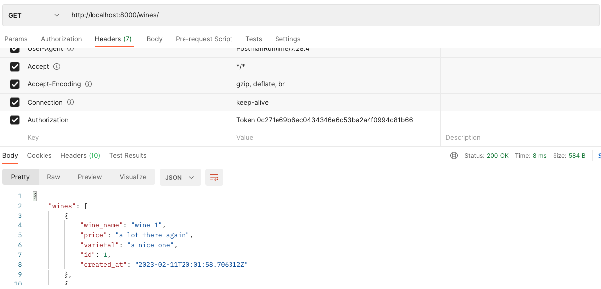

Tuesday, February 14, 2022
=====================
### Video Resources from Previous Cohorts
- [Videos](https://www.youtube.com/channel/UCASZ7zW_Egu0T4KG3YEdGfw/playlists)

# Adding Token Auth to Django Rest Framework

We will be adding auth to yesterday's wine API [here](https://github.com/deltaplatoonew/drf-wine-api-v1).

There are several ways to incorporate authentication/authorization into a DRF app.  The simplest to use (assuming a React frontend) is probably [token authentication](https://www.django-rest-framework.org/api-guide/authentication/#tokenauthentication), but you should use what is most appropriate for your needs.  The basic idea is that a user would log in (after having signed up, of course) using username/password, and would then be given a token (a random alphanumeric string) that would be used for authentication/authorization from that point on.

Like Django, DRF gives us some auth stuff for free, but we will have to implement the sign up view ourselves.

Let's start by creating an `accounts` app: `django-admin startapp accounts`.

In the projects `settings.py`add `accounts` and `rest_framework.authtoken` to `INSTALLED_APPS`.  Then at the bottom (or really anywhere), add this configuration:

```python
REST_FRAMEWORK = {
    'DEFAULT_PERMISSION_CLASSES': [
        'rest_framework.permissions.IsAuthenticated', # protects every resource by default
    ],
    'DEFAULT_AUTHENTICATION_CLASSES': [
        'rest_framework.authentication.TokenAuthentication', # how we will authenticate
    ]
}
```
In the project's `urls.py`, add this to `urlpatterns`: `path('accounts/', include("accounts.urls"))`.

In the newly created `accounts` app's `urls.py`, paste in this:

```python
from django.urls import path
from rest_framework.authtoken.views import obtain_auth_token
from .views import SignupView

urlpatterns = [
    path('get-token', obtain_auth_token),
    path('signup', SignupView.as_view())
]
```

`obtain_auth_token` is a freebie from DRF.  The source code is [here](https://github.com/encode/django-rest-framework/blob/master/rest_framework/authtoken/views.py).  You could have written it yourself, but why bother?

Then in `accounts.views`, we need to implement the promised `SignupView`:

```python
from rest_framework.generics import CreateAPIView
from django.contrib.auth.models import User
from .serializers import SignupSerializer
from rest_framework.permissions import AllowAny


class SignupView(CreateAPIView):
    queryset = User.objects.all()
    serializer_class = SignupSerializer
    permission_classes = [AllowAny]

    def perform_create(self, serializer):
        if serializer.is_valid():
            username = serializer.validated_data["username"]
            password = serializer.validated_data["password"]
            User.objects.create_user(username=username, password=password)
```

`SignupView` is a customized [CreateAPIView](https://www.django-rest-framework.org/api-guide/generic-views/#createapiview), because we need to create a user.  The first thing we have to do is loosen up the permissions so that new users can actually access the sign up route.  The second thing is overriding `perform_create`. From the [docs](https://www.django-rest-framework.org/api-guide/generic-views/#createapiview):
> perform_create(self, serializer) - Called by CreateModelMixin when saving a new object instance.

The main reason for the extra hassle is that creating an instance of User requires us to handle password hashing.  And for that, we have to use the special-purpose `create_user` method.

Next we'll need to create the `SignupSerializer`.  Create a `serializers.py` file in `accounts` and add this:
```python
from rest_framework.serializers import ModelSerializer
from django.contrib.auth.models import User

class SignupSerializer(ModelSerializer):
    class Meta:
        model = User
        fields = ["username", "password"]
```
Since we're not doing anything special with the serializer, we'll use the it-seems-too-easy [ModelSerializer](https://www.django-rest-framework.org/api-guide/serializers/#modelserializer).

That should be it.  Run migrations and the dev server, and make some requests with Postman.

In order to see any of the wines, you'll need to first sign up, then get a token, then include the token when you request a resource.  Here's an example of what that last step looks like:




A completed copy of today's code can be found [here on the withAuth branch](https://github.com/deltaplatoonew/drf-wine-api-v1).

## Challenges
* Review this tutorial
* Add authentication to yesterday's React app.  HINT: just store the token in the browser's local storage.
