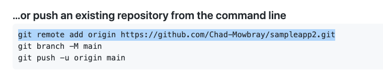
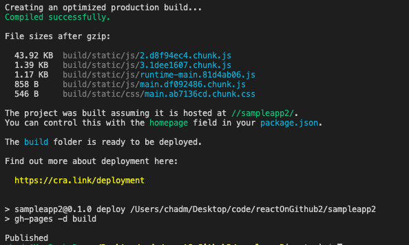
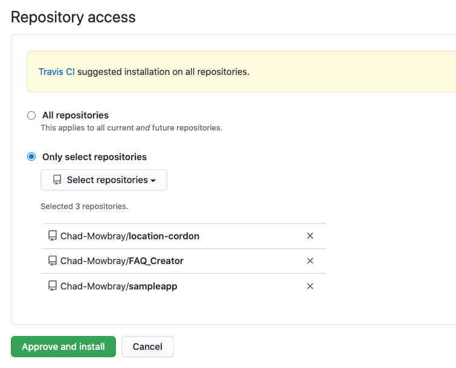
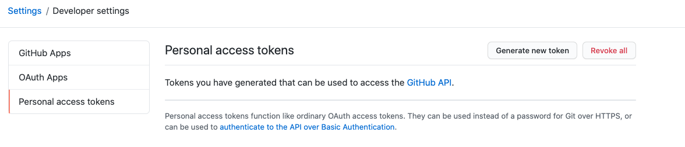
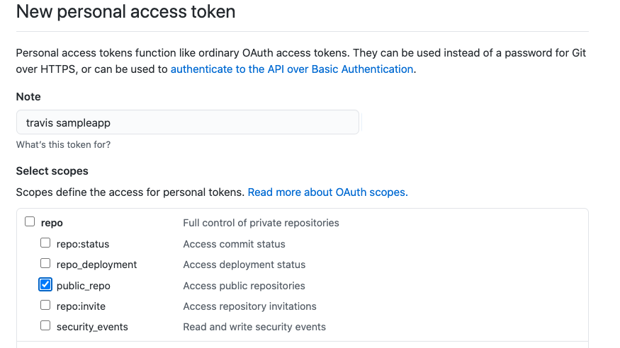
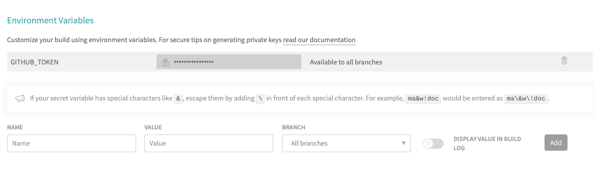
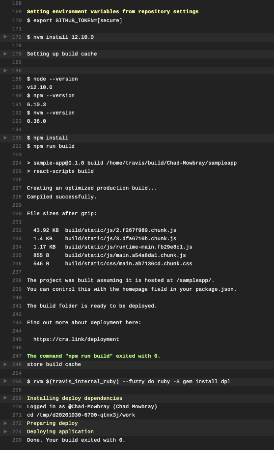
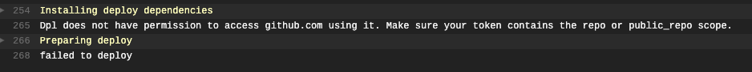
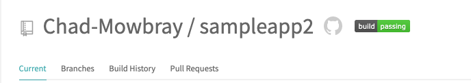

======================
# Continuous Integration with Github Pages and Travis CI

Continuous Integration and Continuous Delivery (CI/CD) are quickly becoming industry standards in software development.  Today we are going to focus on the first term: Continuous Integration.  Continuous Integration basically means setting up "pipelines" to thoroughly test a codebase every time a change is made.

1. You as a developer make some small change to the codebase and submit a PR.
2. Some system (we will be using Travis CI) detects the change.
3. The code (with your changes) is then built from scratch in a new environment -- almost certainly containerized.
4. If nothing blows up, some initial tests are run (unit tests, linters, etc.)
5. If nothing fails, the changes will undergo further tests with more of the codebase (integration testing).

A given pipeline can be more or less complex depending on a variety of factors.  But the important part is that the process is automated.  This makes the process of changing code transparent and consistent for everyone.  It also makes it more difficult for bugs to creep in and stay hidden.

When working on your group project, this can be a very handy process to have set up.  Every time someone pushes up a PR, the project is built from scratch using the same versions of all the packages, operating systems, etc.  If you set up your testing environment to mirror your production environment (Heroku, or similar), this should guarantee that you won't have major last-minute surprises when you go to deploy.  If you also have thorough tests, you can be confident that you are catching problems early on.

A few popular pipeline tools are: [Jenkins](https://www.jenkins.io/), [Concourse](https://concourse-ci.org/), and [CircleCI](https://circleci.com/). Lucky for us, Github is nicely integrated with another CI tool that can help us set up a continuous integration pipeline: [Travis CI](https://travis-ci.com/) .

Today we will learn how to deploy a React project to Github pages, a free Github feature that you can use instead of/in addition to other services like [Heroku](https://www.heroku.com/) or [Netlifly](https://www.netlify.com/).  Travis CI is a continuous integration tool that can be added to your Github repo.  Travis CI allows you to build your project and run tests in a fresh environment every time you push up to your repo.  It's a great way to ensure consistency and quality as you develop an application.


### Create a React project
Create a new React project (or use an old one).  You can even just use the default one that is created with create-react-app.  Here is the App.js used for this simple example:

```javascript
import './App.css';
import React from 'react'

class App extends React.Component {

  state = {
    title: "loading..."
  }

  async componentDidMount() {
    let res = await fetch('https://jsonplaceholder.typicode.com/todos/1')
    let resJson = await res.json()
    this.setState({title: resJson.title})
  }
  render(){
    return (
      <div className="App">
        <h1>This is a sample app to test github pages</h1>
        <h2>Some loaded stuff: {this.state.title}</h2>
      </div>
    );
  }
}
export default App;
```

### Add your repo to github pages
First you will need to add Github pages as a development dependency:
```bash
npm install gh-pages --save-dev
```

Then you will create a Github repo and point your local repo to your new Github repo:


Push up your code.

Next you will need to add some configuration to your package.json. At the top level of the JSON object, add a key called "homepage" that will be the URL where your app is hosted:
```json
"homepage": "http://[YOUR_GITHUB_USERNAME].github.io/[REPO_NAME]"
```
Now add two "scripts":
```json
“predeploy”: “npm run build”,
“deploy”: “gh-pages -d build”
```

Your package.json should look like this:
```json
{
  "homepage": "http://Chad-Mowbray.github.io/sampleapp",
  "name": "sample-app",
  "version": "0.1.0",
  "private": true,
  "dependencies": {
    "@testing-library/jest-dom": "^5.11.5",
    "@testing-library/react": "^11.1.0",
    "@testing-library/user-event": "^12.1.10",
    "react": "^17.0.1",
    "react-dom": "^17.0.1",
    "react-scripts": "4.0.0",
    "web-vitals": "^0.2.4"
  },
  "scripts": {
    "predeploy": "npm run build",
    "deploy": "gh-pages -d build",
    "start": "react-scripts start",
    "build": "react-scripts build",
    "test": "react-scripts test --watchAll",
    "eject": "react-scripts eject"
  },
  "eslintConfig": {
    "extends": [
      "react-app",
      "react-app/jest"
    ]
  },
  "browserslist": {
    "production": [
      ">0.2%",
      "not dead",
      "not op_mini all"
    ],
    "development": [
      "last 1 chrome version",
      "last 1 firefox version",
      "last 1 safari version"
    ]
  },
  "devDependencies": {
    "gh-pages": "^3.1.0"
  }
}
```

Now your application is ready to be deployed to Github pages:
```bash
npm run deploy
```

If successful, you should see something like this:



And you should be able to visit your site hosted on Github.


## Integrating Travis CI
Now that we have our React app deployed, we want to make sure that any future changes run through the pipeline first.

We will need to add a file to the root of our app called ".travis.yml" (note the dot at the beginning).  As a default the .travis.yml file should look like this:

```yaml
language: node_js
node_js:
    - lts/*
cache: npm

install:
    - npm install

script:
    - npm run build

deploy:
    provider: pages
    skip_cleanup: true
    github-token: $GITHUB_TOKEN
    local_dir: build
    on:
        branch: master
```

Here we're telling Travis CI how to set up our environment, and what to run.  You will likely want to change a few things around when you start working on your own project.

You will need to create an account with Travis CI.  Once you do that, go into your settings: https://travis-ci.com/account/repositories, and click on "Activate".

In "Repository access", select the repo you'd like to integrate:



Click "Approve and Install"

You'll be redirected back to Travis CI.  If you go to your dashboard, you should be able to select your repo.  But you won't be able to run a build just yet.  In order to proceed, you'll need to get a github token so that Travis has the necessary permissions.

When you are logged in to your github account, go to https://github.com/settings/tokens and click on "Generate new token":



You can optionally create a Note (for later reference).  But you must choose a scope of either "repo" or "public_repo".



Click "Generate Token", then copy the token.

Go to your repo in Travis-CI.
1. Click on the "More options" hamburger menu.
2. Click on "Settings".
3. Paste the token in the "Value" field under "Environment Variables".
Make sure that "Name" is the value of the environment variable in your .travis.yml file.



Now try pushing up to your Github repo.  If everything has been properly set up, you should be able to go to your repo on Travis and see your build start automatically after a few seconds.

If it builds successfully, it will look something like this:



Note the environment variable with your token.

Make sure that your token has either repo or public_repo scope, or you will get an error like this:



Go ahead and try making a change to your repo, pushing up the change, watching the build run, and then checking your Github pages site.  (<strong>Note: You might have to wait a minute for everything to percolate</strong>)

Now, whenever you push up changes to github, a build will automatically trigger, and you'll know that you have a working app!


### Bonus
You can also add a "badge" to your repo, so you and everyone else can quickly see your build status.  To add the badge, go to your project in Travis CI and click on the build widget:



Choose markdown as the format, and paste the markdown into your repo's README.md.
