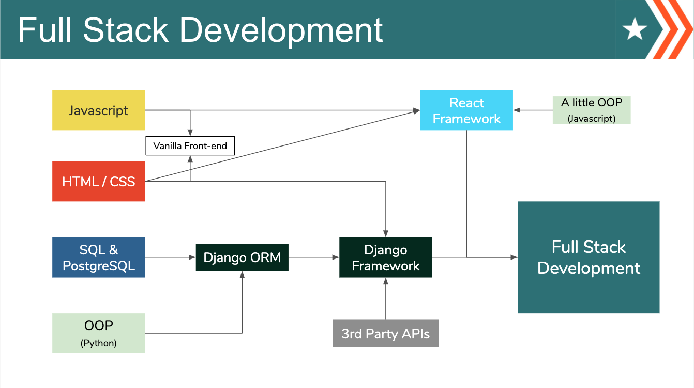

# Part-Time delta Platoon Curriculum

## Welcome
Students, welcome to Code Platoon! Be prepared to push yourself and to work hard towards your new career. We are happy you are here and are here to support you. If you need anything, please don't hesitate to ask. There are many resources available to you on your journey!

## Getting Started
This diagram shows the basic summary of the path we will take to becoming full-stack developers:
 

### Module 1: Fundamentals
### Module 2: SQL, HTML, and HTTP
### Module 3: Django
### Module 4: React, DRF, and Cybersecurity
### Module 5: Projects and Interview Prep

Click [here](https://drive.google.com/file/d/1qQRc-WRZru_immQcLpBRza_8DFTdk1Q8/view?usp=sharing) to view the student handbook.

## Submitting Work for Review
1. Navigate to your desktop from your terminal(`cd ~/desktop`)
2. Hit the `Fork` icon on the top right to copy the repo to your username instead of `deltaplatoonew`
3. Clone down the repository to your desktop (`git clone REPO_LINK.git`)
4. Checkout a new branch (`git checkout -b SOLO/PAIR_YOUR_GITHUB_USERNAME`)
5. Update whatever work you need to
6. Add the changes (`git add CHANGED_FILENAME`)
7. Commit the changes (`git commit -m "SOME MESSAGE HERE"`)
   - Repeat the above three steps until you've completed your work, and it's ready to review
8. Push the changes up to Github (`git push origin NAME_OF_BRANCH`)
9. Open a pull request, comparing your forked `branch` to the original `master` branch

## Daily Check-ins
It is important for you to have a place to talk about how you are feeling and how you feel you are progressing. Every day before class starts, please fill out [this form](https://forms.gle/zfgF7EB9UrE5XaFz8).

## What should I do if I finish everything on any given day?
1. Help those around you. Teaching solidifies learning.
2. Take a peek at the next day's content to get yourself a head start.
3. Go through [edabit](https://edabit.com/), [Code Wars](https://www.codewars.com/), or [LeetCode](https://leetcode.com/)
4. Visit [Pramp](https://www.pramp.com/promo/codeplatoon) to interview with other people - we have an agreement with them to get their premium plan for free!
5. [Interview Cake](https://www.interviewcake.com/table-of-contents)
6. Work on a side-skill (Data Visualization, Machine Learning, Web Sockets, etc.).  Finding something you are interested in and can learn on your own is useful in itself, and can also help you out when it comes to final projects.

## Video Links
Classroom videos/lectures will be recorded and posted to [YouTube](https://www.youtube.com/playlist?list=PLu0CiQ7bzwESuU4RV_3aCg-9z3a1sBSZ3)
<!-- [Vimeo](https://vimeo.com/user/47788820/folder/1615475). -->

## Links to All Modules:
[Module 1: Javascript and Python Fundamentals](https://github.com/deltaplatoonew/curriculum/tree/master/Module-1--Javascript-and-Python-Fundamentals) 
[Module 2: SQL, HTML, and HTTP](https://github.com/deltaplatoonew/curriculum/tree/master/Module-2--SQL-HTML-HTTP) 
[Module 3: Django](https://github.com/deltaplatoonew/curriculum/tree/master/Module-3--Django) 
[Module 4: React, DRF, and Cybersecurity](https://github.com/deltaplatoonew/curriculum/tree/master/Module-4--React-DRF-Cybersecurity) 
[Module 5: Projects](https://github.com/deltaplatoonew/curriculum/tree/master/Module-5--Projects) 
